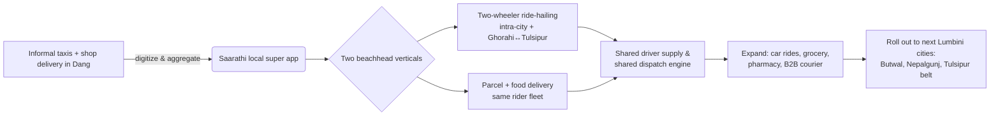

# 01 — Market & Opportunity

> Scope: Is there a real, winnable market for a rides + delivery super app in **Dang, Lumbini Province**? Who competes, and where is the gap?

---

## 1. The market context: Nepal

Nepal's app-based mobility and delivery market has grown for ~9 years in a **legal vacuum** that is now closing:

- **2017** — *Tootle* launches (Nepali, first ride-sharing app, two-wheeler focused).
- **2018** — *Pathao* (Bangladesh) enters and rapidly becomes the category leader; evolves into a **super app** (bike, car, food, parcel, courier).
- **2020s** — *inDrive* (global, peer-to-peer fare bargaining) enters and grows fast.
- **Jan 2025** — Supreme Court orders the government to **legislate** ride-sharing.
- **Apr 2026** — Government publishes the **draft Digital Mobility Service Operation Standards, 2082** (see [02](02-regulatory-compliance.md)).

**Why demand exists (nationwide drivers):**

- Unreliable, low-frequency public transport.
- Rising urban congestion and vehicle ownership.
- A young, smartphone-equipped population comfortable with apps.
- An **exploding digital-payments base**: NPR **98.43 trillion** processed in FY 2024/25 (**+71% YoY**), with QR acceptance at 50,000+ merchants and Fonepay surpassing **1M QR transactions in a single day**.

---

## 2. The local context: Dang district (Lumbini Province)

Dang is an **Inner Terai** district with two **sub-metropolitan cities** that anchor the local economy:

| City | Role |
|------|------|
| **Ghorahi** | Largest city in Dang; commercial & administrative hub. |
| **Tulsipur** | Second hub; education, trade, gateway toward Rolpa/Pyuthan hills. |
| **Lamahi / Deukhuri** | Pr*vinci*l-capital corridor along the East–West & Rapti highways; growing administrative weight (Deukhuri hosts the provincial capital). |
**
**Why Dang is an attractive *first* market for a bootstrapped founder:**

1. **Incumbent coverage gap.** Public service-city lists for Pathao show Kathmandu, Pokhara, Chitwan, and the bigger Terai hubs (Butwal, Bhairahawa, Nepalgunj, Birgunj, Dharan, etc.) — **not Ghorahi/Tulsipur/Dang.** You can become the *default* local app before national players arrive.
2. **Compact, twin-city geography.** Two dense cores ~30 km apart on a highway create natural **intra-city rides** plus a lucrative **inter-city (Ghorahi↔Tulsipur) lane** for both passengers and parcels.
3. **Two-wheeler-dominant vehicle mix.** Matches the cheapest, fastest-to-onboard supply (motorbikes), and the lowest fare ceiling tier (NPR 25/km).
4. **Provincial-capital tailwind.** Government presence in Deukhuri drives commuting, courier, and document-delivery demand.
5. **Local trust advantage.** A "made-in-Dang" brand (सारथी), local-language support, and cash-friendly settlement can out-localize a Kathmandu-HQ'd competitor.

**Honest risks / headwinds:**

- **Lower density & income** than Kathmandu → lower trips/day per driver, thinner margins. Unit economics must be tight from day one.
- **Cold-start liquidity** — the classic chicken-and-egg of riders vs drivers (mitigations in [04](04-operational-procedures.md)).
- **Cash culture** — many riders/drivers still prefer cash; digital settlement adoption needs nudging.
- **Offline-ride leakage** — once a rider knows a driver, they may book directly, bypassing the app (a risk the government draft itself flags).
- **Regulatory cost** — the new standard adds compliance overhead (insurance, SSF, accident fund, Nepali hosting) that didn't exist for early Pathao.

---

## 3. Competitor landscape

| Player | Model | Verticals | Presence relevant to Dang | Strengths | Weaknesses you can exploit |
|--------|-------|-----------|---------------------------|-----------|----------------------------|
| **Pathao** | Fixed app-metered fare; ~super app | Bike, Car, Food, Parcel, Courier | Strong in big cities; **not in Dang** | Brand, scale, capital, merchant network | Kathmandu-centric, generic UX, slow to enter small cities |
| **inDrive** | **P2P fare bargaining**, cash direct to driver, 10–12.99% commission | Rides; expanding to delivery, courier, fintech | Opportunistic; thin in tier-3 | Driver-friendly economics, viral in emerging markets | No local ops/support, no merchant tie-ins, weak delivery in Nepal |
| **Tootle** | Two-wheeler ride-sharing (legacy) | Rides | Faded; minimal | First-mover nostalgia | Lost momentum, limited product |
| **Local taxis / tempos / informal** | Negotiated/fixed | Rides, ad-hoc parcels | **Dominant today in Dang** | Established, trusted, cash | No app, no tracking, no transparency, inconsistent pricing |
| **Local shops / restaurants** | Own boys on bikes | Ad-hoc delivery | Fragmented | Personal relationships | No aggregation, no tracking, no scale |

**Strategic read:** Your *real* day-one competitor in Dang is **informal taxis and shop-owned delivery**, not Pathao. Your job is to **digitize and aggregate** that existing behavior — not to win a price war with a national app that isn't there yet.

---

## 4. The opportunity / wedge

**Wedge thesis in one line:** *Own the two-wheeler rider fleet in Dang, then monetize it across both rides and delivery on a single dispatch engine, while staying compliance-native and cash-friendly.*

**Why a super app (not single-vertical) makes sense here even though it's harder:**

- The **same motorbike rider** can do a passenger trip at 9am and a parcel at 11am and a lunch delivery at 1pm → **higher driver utilization** = better retention in a low-density market.
- One acquisition funnel, one wallet, one support team → **lower CAC and opex per vertical.**
- Defensibility: a rider who earns across three verticals is far less likely to churn to a single-vertical entrant.

---

## 5. Monetization (compliance-aware)

The 2082 draft **caps commission at 10%** for app-only operators. Plan revenue around that ceiling, not above it:

| Stream | Notes |
|--------|-------|
| **Ride commission (≤10%)** | Core. Must show fare transparently in-app within fare ceilings. |
| **Delivery fee / commission** | Delivery isn't a "ride-share fare," so structure carefully — likely a **delivery service fee** paid by customer/merchant rather than a driver commission. Confirm legal treatment. |
| **Merchant onboarding / SaaS** | Restaurants & shops pay for listing, menu management, order dashboard. |
| **Advertising / featured placement** | Local restaurants and shops promoted in-app (inDrive globally is moving to ads). |
| **Surge within legal bounds** | Up to **+20%** night/weather/wait, as the draft permits. |
| **Financial services (later)** | Driver micro-loans, fuel credit, insurance (inDrive Money is the global template) — only after scale and NRB-compliant partners. |

> 💡 With a 10% ceiling, **volume and utilization** — not take-rate — are your levers. This is the central financial reason to run rides + delivery on one fleet.

---

## 6. Go-to-market sequencing

1. **Phase 0 — Pre-launch (Dang):** Recruit 50–150 motorbike riders in Ghorahi & Tulsipur; sign 20–40 restaurants/shops; build cash+wallet settlement; secure DoTM permit & insurance partner.
2. **Phase 1 — Soft launch:** Two-wheeler rides + parcel in Ghorahi first (tighter geography), then Tulsipur, then the Ghorahi↔Tulsipur lane.
3. **Phase 2 — Densify:** Add food delivery, then car rides; push digital settlement; referral loops for riders & customers.
4. **Phase 3 — Expand:** Replicate the proven Dang playbook to the next Lumbini cities (Butwal, Nepalgunj, Tulsipur belt) where you can still beat or match incumbents on localization.

---

## 7. What to validate next (founder actions)

- [ ] **Field count:** Walk Ghorahi & Tulsipur — count active taxis, tempos, and shop delivery boys. Estimate daily trip demand.
- [ ] **Driver interviews (10–15):** Current earnings, smartphone ownership, wallet comfort, willingness to do both rides + delivery.
- [ ] **Merchant interviews (10–15):** Current delivery pain, willingness to pay a fee/commission.
- [ ] **Confirm incumbent absence:** Open Pathao/inDrive in Dang and check live driver availability.
- [ ] **Pricing test:** Model driver take-home at NPR 25/km, 10% commission, realistic trips/day — does it clear local opportunity cost?

➡️ Continue to [02 — Regulatory & Compliance](02-regulatory-compliance.md).
