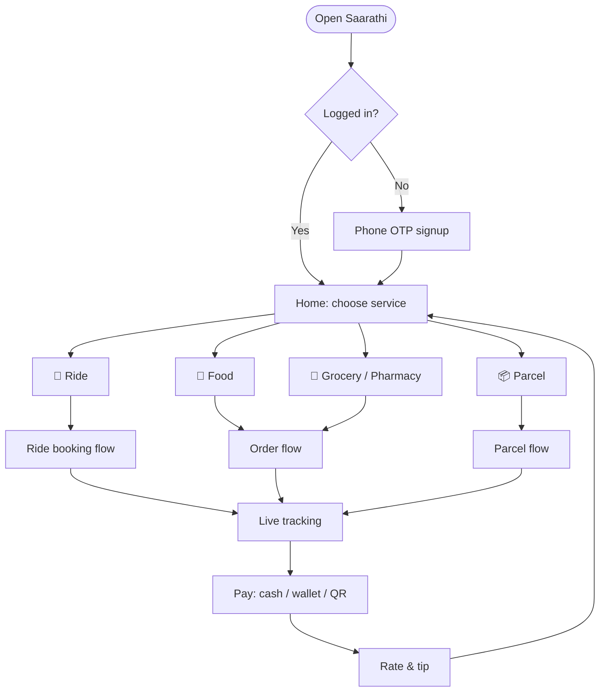
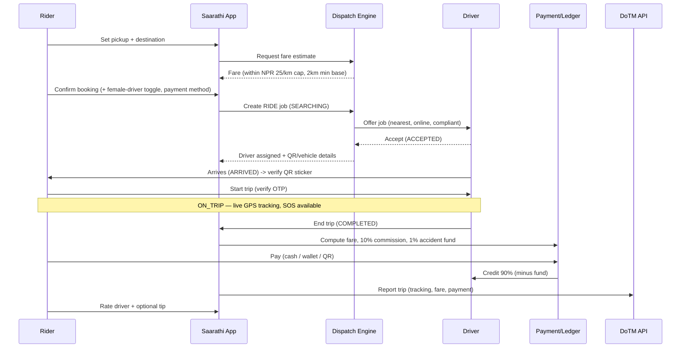
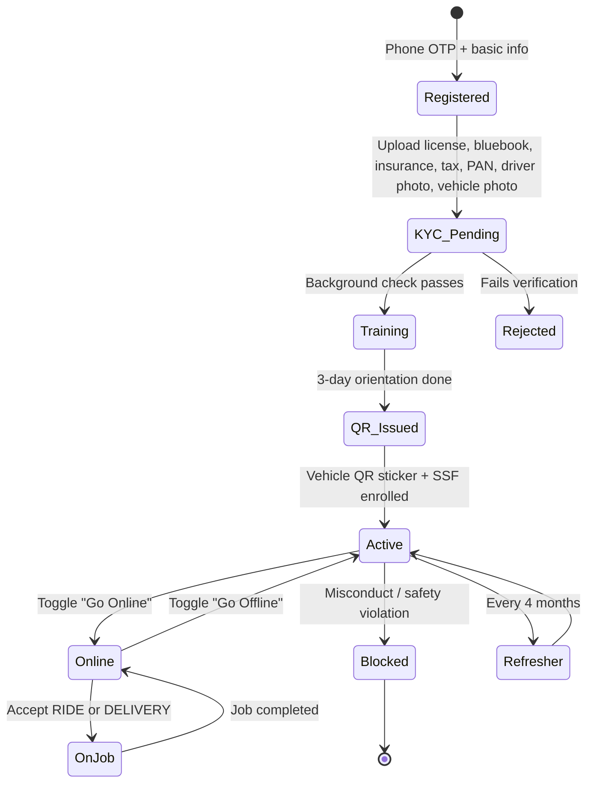
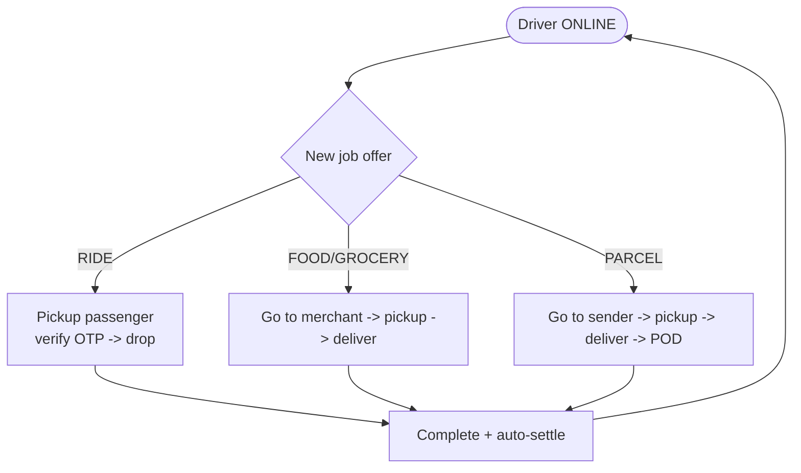
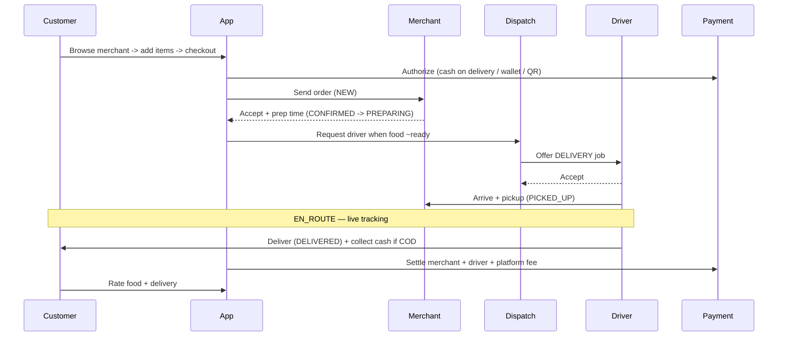
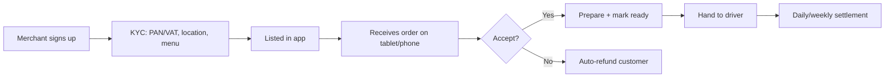
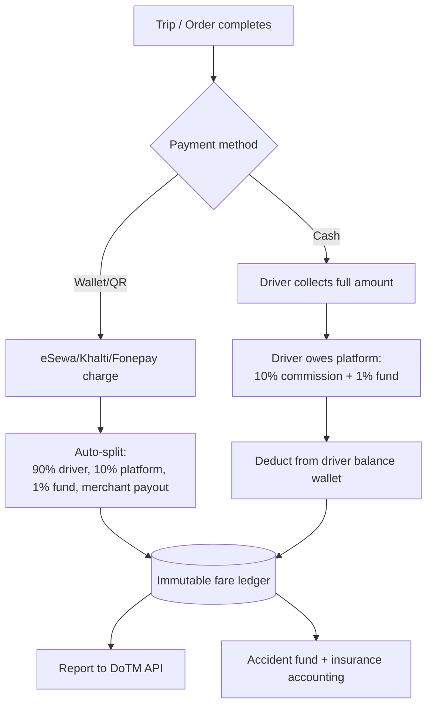
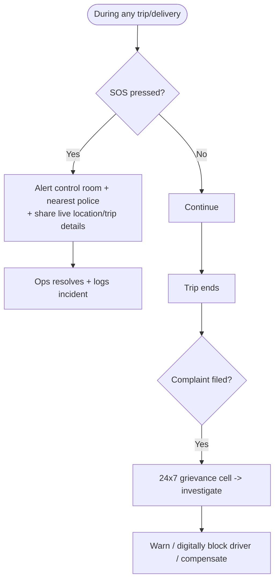

# 03 — User Flows & Journeys

> Scope: How each actor moves through Saarathi end-to-end. This is the **"flows" focus** you asked for. Diagrams are Mermaid; states are explicit so they map directly to the backend state machines in [05](05-technical-architecture.md).

---

## 0. The actors

| Actor | Role |
|-------|------|
| **Rider (passenger)** | Books a person-trip (two-wheeler or car). |
| **Customer (delivery)** | Orders food/parcel/grocery to be delivered. |
| **Driver / Rider-partner** | Single fleet that fulfills **both** rides and deliveries. |
| **Merchant** | Restaurant/shop whose goods are delivered. |
| **Ops / Support** | Control room: dispatch oversight, SOS, grievances, KYC. |
| **DoTM (regulator)** | Receives compliance data via API; not an app user but a system actor. |

> **Core design principle:** one driver app, one dispatch engine, **two job types** (RIDE, DELIVERY). This is the structural reason a super app beats single-vertical here.

---

## 1. Top-level app map

---

## 2. Rider (passenger) journey — ride-hailing

### 2.1 Happy-path flow

### 2.2 Rider states

`SEARCHING → ASSIGNED → ARRIVED → ON_TRIP → COMPLETED → RATED`
Side-states: `NO_DRIVER_FOUND`, `CANCELLED_BY_RIDER`, `CANCELLED_BY_DRIVER`, `SOS_TRIGGERED`.

### 2.3 Key UX decisions (localized for Dang)

- **Pricing model:** Use **transparent metered fare** (distance × rate, capped) — *not* inDrive-style haggling — because it's simpler to keep within legal caps and builds trust. Optionally allow a small **tip**.
- **Map-light fallback:** Many pickups are landmark-based, not precise pins. Support **landmark + "share live location" + call driver**.
- **Female-driver toggle** surfaced at booking (legal requirement + trust differentiator).
- **QR verification:** Rider scans the vehicle's DoTM QR sticker to confirm driver/vehicle authenticity before boarding.
- **OTP start:** Trip starts only after rider gives the driver a one-time code → prevents wrong-pickup fraud.
- **Cash-first, digital-nudged:** Default cash but nudge wallet/QR with small incentives.

### 2.4 Edge cases to design for

- No driver found → auto-retry, widen radius, offer "notify me" or schedule.
- Rider cancels after assignment → grace window, then cancellation policy.
- GPS drift in dense bazaar areas → landmark confirmation + driver call.
- Connectivity drop mid-trip → cache trip state locally, reconcile on reconnect.

---

## 3. Driver / rider-partner journey (shared fleet)

### 3.1 Lifecycle

### 3.2 The unified job offer (rides AND delivery on one screen)

### 3.3 Driver UX decisions

- **One toggle, all jobs:** Driver opts into job types (rides, food, parcel) they'll accept → maximizes utilization in a thin market.
- **Earnings clarity:** Show **net** earning per job up front (after 10% + 1% fund) — drivers trust transparency, and inDrive won emerging markets partly on this.
- **12-hour cap enforcement:** App must lock new jobs after 12h online (legal anti-fatigue rule).
- **Compliance nudges:** Dashboard warns before license/fitness/insurance expiry, and before QR sticker's 1-year renewal.
- **Cash reconciliation:** For cash trips, driver owes platform the commission+fund → track a **driver balance wallet**; settle via wallet top-up or deduct from digital-trip earnings.

---

## 4. Delivery customer journey (food / grocery / pharmacy)

**Order states:** `CART → PLACED → CONFIRMED → PREPARING → READY → PICKED_UP → EN_ROUTE → DELIVERED → RATED` (+ `REJECTED_BY_MERCHANT`, `CANCELLED`, `FAILED_DELIVERY`).

**Delivery UX decisions:**

- **COD is king early** — design cash-on-delivery as the default, with reconciliation flowing into the driver balance wallet.
- **Merchant prep-time realism** — let merchants set/adjust prep time; dispatch the driver to arrive *as food is ready*, not before (avoids idle riders) and not late (avoids cold food).
- **Batching (later):** In dense bazaars, allow a rider to carry 2 nearby orders.
- **Parcel proof-of-delivery (POD):** photo + recipient name/OTP for parcels.

---

## 5. Merchant journey

**Merchant decisions:**

- Start with a **lightweight merchant app / web dashboard** (even WhatsApp-assisted order confirmation in v0).
- **Menu + availability toggles** (out-of-stock is the #1 cause of cancellations).
- **Settlement cadence**: daily or weekly bank/wallet payout via ConnectIPS/Fonepay.

---

## 6. Payment & settlement flow (cross-cutting)

> The **immutable fare ledger** is the heart of compliance: every trip records fare, 10% commission, 1% accident fund, driver payout, payment method, and DoTM report status.

---

## 7. Safety & trust flow (legally mandated)

**Safety features (all required by the 2082 standard):**

- **SOS button** → control room + nearest police.
- **QR sticker verification** before boarding.
- **Female-passenger → female-driver** option.
- **24×7 grievance & rescue cell.**
- **Zero-tolerance** auto-block for harassment/DUI/unsafe driving/offline rides.
- **Trip sharing** (share live trip with family).
- **In-app masked chat & call** — rider↔driver coordinate (esp. for landmark-based pickups) without sharing real phone numbers. (See [05 §6](05-technical-architecture.md).)

---

## 8. Flow-level design principles (carry into build)

1. **Cash-first, digital-nudged** across every vertical.
2. **One driver, one dispatch, many job types** — utilization is survival.
3. **Transparent metered pricing** within legal caps (not haggling).
4. **OTP + QR verification** to fight fraud and offline-ride leakage.
5. **Offline-tolerant** clients (cache + reconcile) for patchy connectivity.
6. **Compliance events are part of the flow**, not bolted on — every completed job emits a DoTM report + ledger entry.
7. **Landmark-friendly geolocation** — design for "near X temple," not just precise pins.

➡️ Continue to [04 — Operational Procedures](04-operational-procedures.md).
