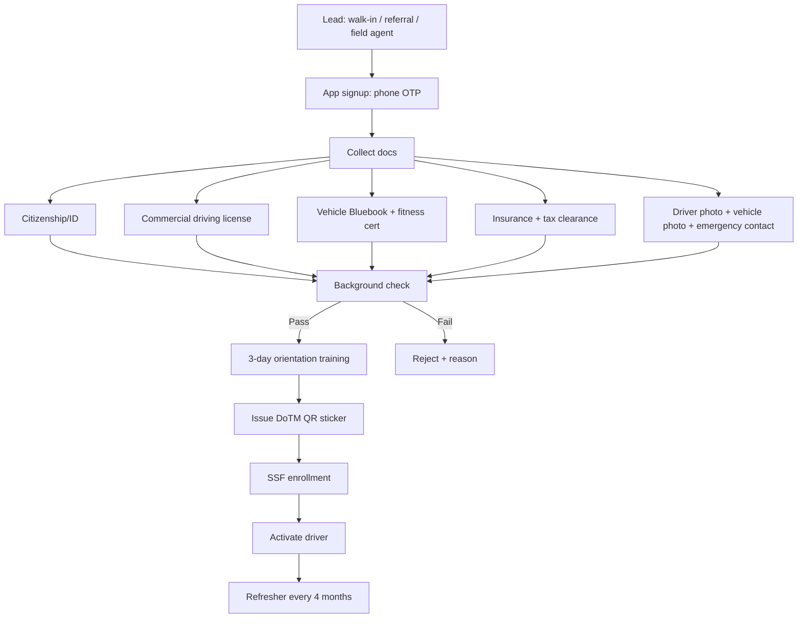
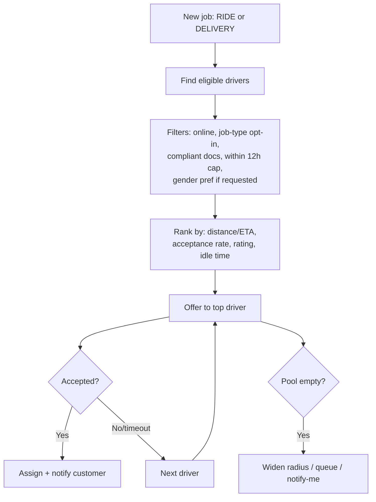
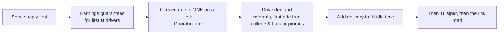

# 04 — Operational Procedures

> Scope: The day-to-day engine — onboarding, dispatch/matching, payments & settlement, support, trust & safety, and the cold-start playbook for Dang.

---

## 1. Onboarding procedures

### 1.1 Driver onboarding (the hardest, most important pipeline)

**Procedural notes:**

- **Convert, don't reject.** Many Dang riders have *private* licenses/bikes. Run a **"get-compliant" assist desk**: help them obtain commercial license, fitness, insurance, tax clearance. This is your supply moat — incumbents won't hand-hold tier-3 drivers.
- **Field onboarding** beats digital-only: a person at a Ghorahi/Tulsipur desk + WhatsApp follow-up converts far better.
- **Document vault:** store license/fitness/insurance/tax with **expiry tracking** and auto-reminders.
- **Training:** 3-day orientation (app use, safety, etiquette, female-passenger policy, fraud/offline-ride rules) + 4-month refreshers, per the 2082 standard.

### 1.2 Merchant onboarding

1. Lead (field/referral) → 2. KYC (PAN/VAT, location pin, owner ID) → 3. Menu/catalog build (photos, prices, prep times) → 4. Device setup (merchant app/tablet or WhatsApp fallback) → 5. Test order → 6. Go live.

### 1.3 Customer/rider onboarding

- **Phone OTP only** (no friction). Optional profile later.
- First-trip discount + referral code.
- Default payment = cash; prompt to link a wallet for a small reward.

---

## 2. Dispatch & matching

**Operational policies:**

- **Sequential offer with short timeout** (e.g., 15–20s) keeps ETAs honest in low-density areas.
- **Fairness vs efficiency:** weight idle-time so earnings spread across drivers (retention in a small fleet matters more than micro-optimizing each ETA).
- **Cross-vertical dispatch:** a free rider near a restaurant can be offered a food job — the engine treats RIDE and DELIVERY as one queue with a type tag.
- **Manual override:** Ops can hand-assign during outages or VIP/edge cases (essential at small scale).
- **Pre-positioning:** nudge drivers toward demand hotspots (bazaar, bus park, college areas) at peak times.

---

## 3. Payments & settlement procedures

### 3.1 The Nepal payments backdrop (why this matters)

- Digital payments hit **NPR 98.43 trillion in FY 2024/25 (+71% YoY)**; QR is ubiquitous (Fonepay >1M QR/day, 50k+ merchants). But **Dang's driver/rider base is still substantially cash.** Design for **both**.

### 3.2 Settlement matrix

| Scenario | Customer pays | Platform action | Driver outcome |
|----------|---------------|-----------------|----------------|
| **Cash ride** | Cash to driver | Driver owes 10% + 1% fund | Deduct from **driver balance wallet** |
| **Digital ride** (eSewa/Khalti/QR) | Into platform | Auto-split | 90% (minus 1% fund) credited |
| **COD delivery** | Cash to driver | Driver remits merchant amount + fees | Net delivery fee credited/owed |
| **Digital delivery** | Into platform | Split merchant + driver + fee | Net fee credited |

### 3.3 Driver balance wallet (the linchpin)

- Tracks what each driver **owes** (cash-trip commissions/fund) vs **is owed** (digital-trip earnings).
- **Top-up** via eSewa/Khalti/Fonepay/ConnectIPS or cash at the field desk.
- **Negative-balance threshold** → driver must settle before going online again (prevents runaway debt).
- **Payout cadence:** daily/weekly to driver bank/wallet via ConnectIPS/Fonepay.

### 3.4 Compliance accounting (every transaction)

- Record into **immutable fare ledger**: gross fare, 10% commission, 1% accident-fund, driver payout, method, DoTM report status.
- **Accident Fund** sub-ledger; remit per rules.
- **Annual affiliation fee** (NPR 1,000 / 5,000) collected at QR issuance; remit to Federal Consolidated Fund by end of Chaitra.
- **Insurance** premium accounting (driver + passenger life cover).

---

## 4. Customer support & grievance (legally required)

- **24×7 grievance & rescue cell** (mandated). At small scale this can be a small roster + on-call escalation, but it must exist and be reachable.
- **Channels:** in-app chat/call, phone hotline, WhatsApp (high adoption in Nepal).
- **Tiered SLAs:** safety/SOS = immediate; payment dispute = hours; general = same day.
- **Incident log:** every SOS/complaint recorded with resolution + driver action (warn/block/compensate).
- **Local-language support** (Nepali; consider Tharu/Awadhi familiarity in Dang) is a differentiator vs national apps.

---

## 5. Trust & safety operations

| Control | Procedure |
|---------|-----------|
| **SOS response** | Control room receives alert → contacts rider + nearest police → logs + follows up. |
| **QR verification** | Riders verify vehicle QR sticker pre-boarding; Ops audits sticker validity (1-yr). |
| **OTP trip start** | Prevents wrong/forced pickups & fare fraud. |
| **Background checks** | At onboarding + periodic re-check. |
| **Offline-ride enforcement** | Monitor cancel-then-complete patterns; penalize off-app rides (the draft suggests NPR 20k–50k penalties). |
| **Female safety** | Female-driver option; flag & fast-track gender-based complaints (zero tolerance). |
| **Fatigue** | Enforce 12h/day app cap. |
| **Driver offboarding** | Digital block on misconduct; document for DoTM. |

---

## 6. The cold-start playbook (Dang-specific)

The chicken-and-egg problem (no riders → drivers idle → drivers leave → no service → no riders) is the #1 killer. Tactics:

1. **Supply before demand:** Recruit 50–150 motorbike drivers first; offer **earnings guarantees / minimum-per-hour** for launch weeks so early drivers don't starve while demand builds.
2. **Geographic concentration:** Don't spread thin. Saturate **Ghorahi core** until ETAs are <10 min, *then* Tulsipur, *then* the inter-city lane.
3. **Demand sparks:** First-ride-free, student promos near colleges, bazaar/market-day pushes, festival campaigns.
4. **Fill idle time with delivery:** The moment a driver waits, offer parcels/food → keeps earnings up and drivers loyal.
5. **Reference local trust:** "Saarathi — Dang ko aafnai app" (Dang's own app). Local ownership beats a distant Kathmandu brand.
6. **Referral loops** on both sides (rider invites rider; driver invites driver).

---

## 7. Operational KPIs to track from week one

| Category | Metric |
|----------|--------|
| **Liquidity** | Active drivers/day, online hours, % requests fulfilled, avg ETA |
| **Demand** | Daily trips/orders, repeat-rate, CAC, referral share |
| **Economics** | Avg fare, trips/driver/day, driver take-home/day, contribution margin |
| **Quality** | Cancellation rate, complaint rate, avg rating, SOS incidents |
| **Compliance** | % compliant drivers, doc-expiry overdue, DoTM report success rate, fund/insurance remittances |
| **Payments** | Cash vs digital mix, driver-wallet negative-balance count, settlement timeliness |

> 🎯 **North-star for a thin market:** **trips per active driver per day.** If that holds above your break-even threshold, the model works; if not, add verticals/density before expanding cities.

➡️ Continue to [05 — Technical Architecture](05-technical-architecture.md).
