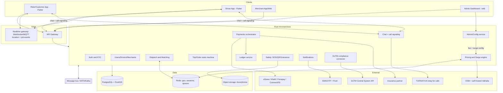
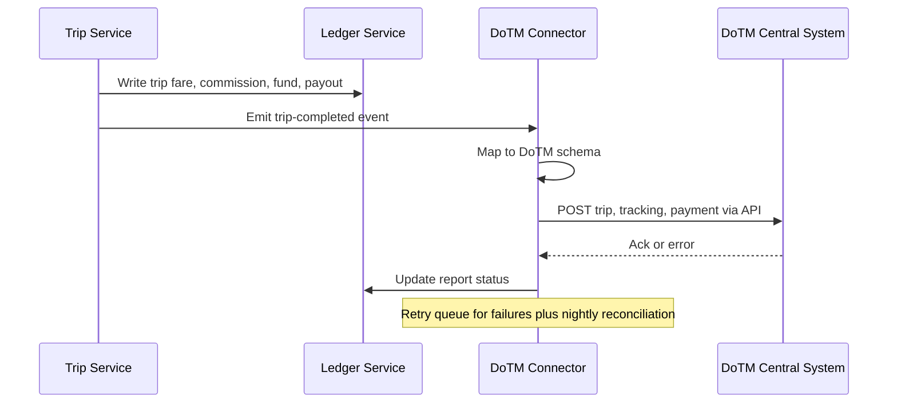
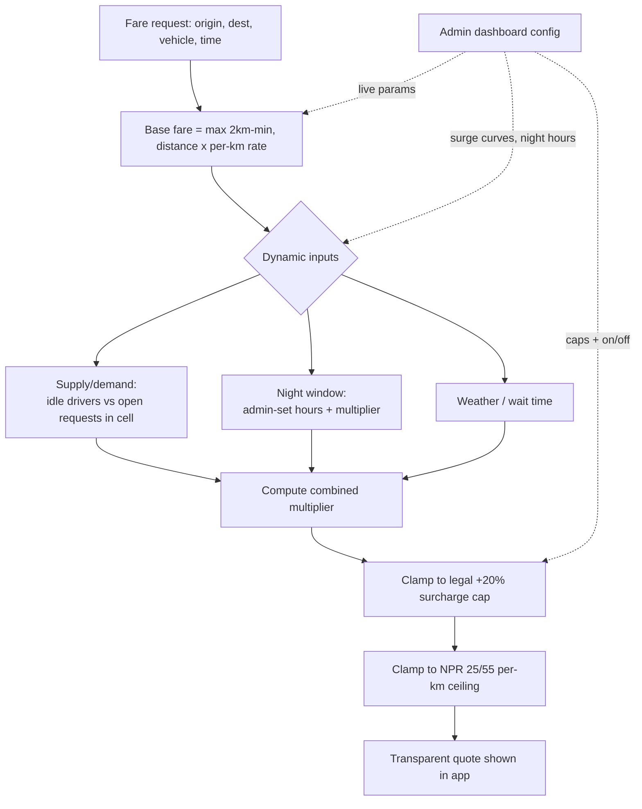
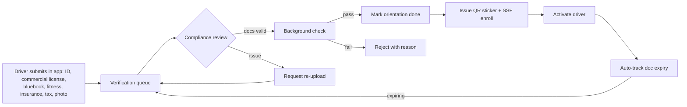
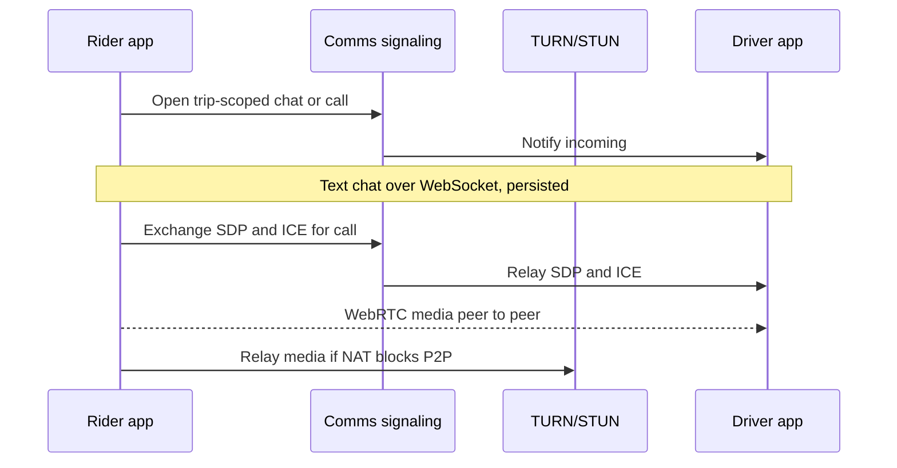
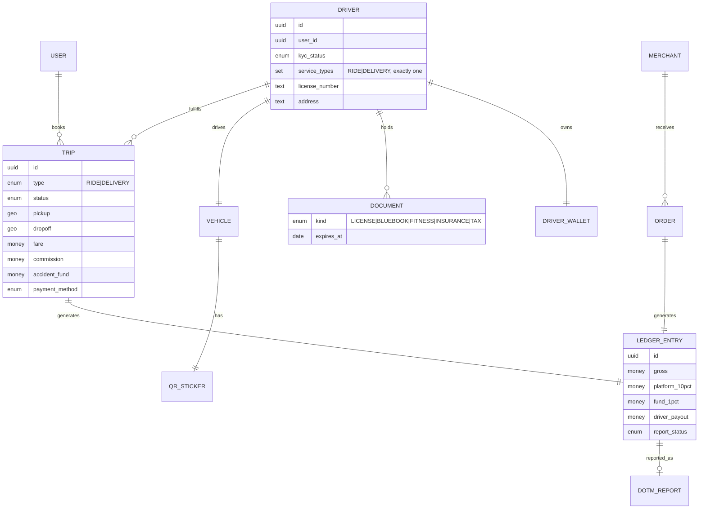
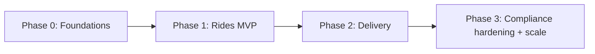

# 05 — Technical Architecture & Approach

> Scope: What to build, in what order, with what stack — **compliance-native** (Nepali hosting + DoTM API), offline-tolerant, and realistic for a solo/lean founder building with Claude. This is an *approach* document, not code.

---

## 1. Architecture principles (derived from prior docs)

1. **Compliance is a core service, not a feature.** Nepali-server hosting, DoTM central-system API, immutable fare ledger, QR verification, SOS — all first-class. (See [02](02-regulatory-compliance.md).)
2. **One dispatch engine, two job types** (RIDE, DELIVERY) — with each driver declaring at KYC which of them they accept, and dispatch filtering on that declaration end-to-end (§5.5.1). (See [03](03-user-flows.md).)
3. **Offline-tolerant clients** — patchy connectivity in Dang; cache + reconcile.
4. **Cash-first money model** — driver balance wallet + pluggable PSPs.
5. **Parameterize the law** — fare caps, commission %, fund %, fees are config, not hardcode. Every pricing knob is **runtime-adjustable from the admin dashboard** (see §5).
6. **Microservices around clear domains** — independently scalable services (dispatch, pricing, payments, compliance) communicating over a message bus. Right call given your distributed-systems background; the discipline below keeps it from becoming an ops burden.
7. **Buy/integrate, don't build** maps, payments, SMS, push — integrate proven providers.

---

## 2. High-level system diagram

---

## 3. Stack — your confirmed choices

> 🧭 **Founder context (from [debendra.me](https://debendra.me)):** 8+ years in **Rust, Go, distributed systems, DevSecOps, Kubernetes, Terraform, CI/CD**, fault-tolerant relayers, and real-time messaging at scale (millions of users, Jitsi). Also React, Python, Lua. **Gap: no native/Flutter mobile experience.** Your confirmed stack — **Rust backend, Flutter apps, microservices** — plays directly to your systems strength and isolates the one area you'll be learning (mobile).

| Layer | Choice | Notes |
|-------|--------|-------|
| **Backend** | **Rust** (microservices) | Your strength + memory-safe, high-throughput, ideal for the always-on dispatch/pricing/realtime hot paths. Use `axum`/`tonic` (gRPC) for services, `sqlx` for Postgres, `tokio` runtime. |
| **Inter-service comms** | **Message bus (NATS or Kafka)** + gRPC | Event-driven (job, payment, compliance events). NATS is lighter to operate solo; Kafka if you need durable replay/audit streams. Start with **NATS JetStream**. |
| **Realtime / dispatch** | **Rust + Redis** (GEOSEARCH) + WebSocket/MQTT | Apply your relayer patterns (outbox, retries, idempotency, self-healing) to dispatch + the DoTM connector. |
| **Mobile apps** ⚠️ | **Flutter** — **Android + iOS at launch** | One Dart codebase ships both. iOS is worth it here: strong usage among students/GenZ and higher-income riders in Nepal. **This is your #1 build risk** — budget extra time, or contract the UI shell while you own all logic/APIs. |
| **In-app comms** | **Chat** (WebSocket/bus) + **P2P voice/video** (WebRTC + self-hosted TURN/STUN) | Masked rider↔driver chat & calls — no real phone numbers shared. Coturn for TURN/STUN; signaling via the comms service. (See §6.) |
| **Admin dashboard** | **React / Next.js** | Confirmed. Driver verification, RBAC user management, live tracking, fee/surge config, SOS, ledger, DoTM reports. (See §5.) |
| **Primary DB** | **PostgreSQL + PostGIS** | Geospatial (nearby drivers) + relational integrity for the ledger. Per-service schemas; shared instance early. |
| **Geo/cache/queues** | **Redis** | Driver geo-index, sessions, rate limits, ephemeral job queues. |
| **Object storage** | MinIO / in-country S3-compatible | KYC docs, POD photos — **kept in Nepal**. |
| **Infra / deploy** | **Terraform + Kubernetes** on a Nepali host | Microservices justify K8s — but **start small** (k3s or a few nodes); scale out only as load demands. Your DevSecOps background is a real moat here. |
| **Maps/routing** | **OSM + self-hosted Valhalla** (routing/ETA/matrix) + map tiles + Nominatim/Photon geocoding | Confirmed for cost control — no per-request Google fees. Trade-off: you own Dang street-data quality (contribute fixes back to OSM). |
| **Payments** | **eSewa, Khalti, Fonepay, ConnectIPS** APIs | Don't build a wallet; ride on their NRB licenses. (See [02](02-regulatory-compliance.md).) |
| **SMS/OTP + Push** | Local SMS aggregator + FCM | OTP is the login backbone. |
| **Hosting** | **Nepal-based cloud/data center** | The 2082 draft mandates Nepali-server hosting. Confirm a compliant in-country provider. |

> ⚠️ **The honest risk:** you can build the Rust services, infra, dispatch, ledger, and DoTM connector faster than most. The **Flutter apps (rider + driver)** are where a solo systems engineer typically stalls. Mitigations: (1) Flutter + heavy Claude assistance, (2) contract a Flutter dev for the UI shell while you own all logic/APIs, or (3) ship the driver app first (simpler) and keep the rider app minimal.

> 🟢 **Microservices discipline (so it doesn't bite a solo founder):** start with a **small number of coarse services** (auth, core-domain, dispatch, pricing, payments, compliance, admin) — *not* 15 nano-services. Share one Postgres instance with per-service schemas early. One repo (monorepo) + one CI/CD pipeline + one Helm chart. Split a service out further only when a real scaling or deploy-isolation need appears.

---

## 4. The compliance connector (your differentiating, legally-required service)

**Design points:**

- **Event-driven + outbox pattern:** trip/payment events go to an outbox; the connector reliably forwards to DoTM with retries.
- **Schema-isolated:** wrap the DoTM API behind an adapter — the spec will change between draft and final law.
- **Reconciliation job:** nightly batch re-sends any failed reports; produces a compliance dashboard for Ops.
- **QR sticker service:** generate/track stickers (1-yr validity), expose a **verify** endpoint scannable by passenger/police apps.

---

## 5. Admin dashboard & dynamic pricing engine

The admin dashboard is a first-class product surface, not an afterthought. It is how you operate Saarathi day-to-day **and** how you tune the economics that [07](07-financial-model.md) shows are razor-thin.

### 5.1 What the admin dashboard controls

| Area | Capabilities |
|------|--------------|
| **User & access management** | Create/suspend staff accounts; assign **roles** (Super Admin, Admin, Dispatcher, Finance, Compliance, Support, Analyst); full audit trail. (See §5.4.) |
| **Driver registration & verification** | Review KYC docs, run/track background checks, approve/reject, issue QR stickers, manage document-expiry & re-verification — the legal onboarding pipeline. Also on-site walk-in KYC capture for drivers who onboard at a desk rather than in the app. (See §5.5.) |
| **Record correction** | Fix a rider's name; a driver's name, licence number, address and vehicle (plate/make/model/year/colour); a merchant's name, vertical, contact and prep time. Also re-set a driver's accepted **job types**. Phone numbers are *not* editable — they're the OTP login identity. Every edit is audit-logged. (See §5.5.) |
| **Live tracking** | Real-time map of every active driver/trip; watch an individual ride, view route/ETA, intervene on SOS. (See §5.6.) |
| **Pricing config** | Set base fare, per-km rate, minimum-distance base, commission %, accident-fund %, platform fees — **per city, per vehicle type, per vertical** — all live, no redeploy. |
| **Dynamic pricing rules** | Configure surge curves (supply/demand), night-time windows & multipliers, weather/wait surcharges, and caps. Toggle auto-pricing on/off. |
| **Operations** | Manual dispatch override, block/unblock, SOS console, grievance queue, in-app chat/call logs & moderation. |
| **Finance** | Ledger view, driver-wallet balances, settlements, accident-fund & insurance remittances, payout runs. |
| **Compliance** | DoTM report status & retries, QR-sticker issuance/expiry, document-expiry tracking, audit logs. |
| **Analytics** | The KPIs in [04 §7](04-operational-procedures.md): liquidity, demand, economics, quality. |

### 5.2 The pricing engine (auto-adjustment, legally bounded)

The pricing service computes a fare from a **base** (admin-configured, within legal caps) times a **dynamic multiplier**, then **hard-clamps** to the law.

$$\text{fare} = \max\big(\text{base}_{\min},\; d \times r_{\text{km}}\big) \times M_{\text{dyn}}$$

$$M_{\text{dyn}} = \operatorname{clamp}\big(M_{\text{supply}} \times M_{\text{night}} \times M_{\text{weather}},\; 1.0,\; 1.20\big)$$

Where the **+20% legal ceiling** on surcharges (night/weather/wait) and the **per-km fare caps** (NPR 25 / 55) are enforced *after* every rule — the engine can never price above the law, regardless of admin input.

**Supply/demand surge (how it actually computes):**

- Divide the city into geohash cells; per cell track **open requests** vs **available drivers** over a short rolling window.
- Demand ratio $\rho = \frac{\text{requests}}{\text{drivers}+1}$ maps to a multiplier via an admin-defined step curve (e.g. $\rho<1 \to 1.0$, $1\!-\!2 \to 1.1$, $>2 \to 1.2$).
- **Capped at the legal +20%** — surge in Nepal cannot be the uncapped Uber-style multiplier; the engine respects the 2082 ceiling.

### 5.3 Non-negotiable guardrails

1. **Legal clamp is server-side and final** — admin can set *anything*; the engine refuses to emit a fare above the per-km cap or beyond +20% surcharge.
2. **Every config change is audited** — who/what/when, with effective timestamps, for DoTM defensibility.
3. **Versioned, effective-dated config** — pricing changes take effect forward; historical trips reprice from the config that was live at trip time (ledger integrity).
4. **Transparent to the rider** — the app shows the fare (and that a night/surge factor applies) before booking, as the standard requires.
5. **Feature-flagged per city/vertical** — launch Ghorahi with flat pricing, enable surge later, all from the dashboard.

> 💡 Because commission is capped at 10% ([07](07-financial-model.md)), dynamic pricing is **not** a margin lever for you — it's a **supply-balancing** lever (pull drivers online at peak) and a small driver-earnings boost. Set expectations accordingly.

### 5.4 User management & roles (RBAC)

Staff access is least-privilege and role-based, enforced **server-side** (not just hidden in the UI). Suggested roles:

| Role | Scope |
|------|-------|
| **Super Admin** | Full control: pricing/legal config, role assignment, financial controls, data export. Very few people. |
| **Admin** | Day-to-day ops & configuration, except sensitive financial and role-assignment controls. |
| **Dispatcher / Ops** | Live tracking, manual dispatch override, SOS handling. |
| **Finance** | Ledger, settlements, payouts, remittances — no pricing or role control. |
| **Compliance Officer** | DoTM reports, QR stickers, driver document verification, audit-log review. |
| **Support Agent** | Grievance queue, chat/call logs, limited rider/driver lookup. |
| **Analyst** | **Read-only** dashboards & exports; no PII edits, no config changes. |

Every privileged action is written to an **immutable audit log** (who, what, when) for DoTM defensibility.

### 5.5 Driver registration & verification (legal workflow)

The dashboard drives the legally-mandated onboarding pipeline ([02 §3](02-regulatory-compliance.md), [04 §1.1](04-operational-procedures.md)). The driver submits documents in the app; staff verify here. Staff can also capture the whole thing on the driver's behalf for a **walk-in** (an on-site KYC form that creates the user, driver, and vehicle in one shot, then takes document photos from a webcam).

**Workflow rules:**

- Each step is **time-stamped and attributable** (which officer approved) for audit defensibility.
- **Document vault** with expiry reminders; auto-suspend a driver on expiry until re-verified.
- **Re-verification** on document expiry and on the standard's periodic cycle.
- Rejections always carry a reason the driver sees, with a re-submit path.
- **Required identity fields** — name, licence number, address, vehicle plate and model — are validated **server-side on both intake paths** (the driver's in-app form and the staff walk-in form), so neither can produce a half-filled record. Make/colour/year and date of birth remain optional.
- **Job type** (rides *or* delivery — exactly one) is captured at registration and stored on the driver row, not inferred. See §5.5.1.

#### 5.5.1 Job-type declaration & correction

`drivers.service_types` is the **persisted source of truth** for which one queue a driver belongs to. Its shape and lifecycle:

- Set at registration (in-app or walk-in); constrained to **exactly one** of `{ride, delivery}` by both a server-side check and a DB `CHECK` constraint (`array_length(service_types, 1) = 1`) — a driver in both queues at once is not a valid state. Stored as a single-element array rather than a plain column, so a future re-introduction of multi-select wouldn't need a column-type migration; the exactly-one rule lives in the constraint and the app-layer validator, not the column shape. Existing rows default to `{ride}`.
- Editable afterwards by staff from the driver's dashboard page — the correction path for "the field agent ticked the wrong box" and for a driver who later wants to switch verticals entirely.
- The driver app **re-reads it on every go-online**, so a dashboard change takes effect on the driver's next shift with no separate push or sync mechanism to keep alive.
- Dispatch reads it via the driver's live presence record, not the DB, on the hot path — see §5.5.2.

#### 5.5.2 How dispatch enforces it

Presence (the Redis record written when a driver goes online and refreshed by heartbeat) carries the driver's job types alongside their position. Every dispatch path filters on it:

- **Matching** — the candidate scan for a trip filters by the trip's own type (`ride` | `delivery`) while it fetches positions, so a driver in the wrong queue is never even ranked, let alone offered.
- **Supply counts** — the same filter applies to the "how many drivers are nearby" probes that back the rider app's booking gate and the merchant's "no couriers nearby" warning. These are counted **per job type**: ride-only drivers do not inflate courier availability, and vice versa. (This matters the moment the two populations diverge; before the split they were the same set and the distinction was invisible.)
- Merchant/marketplace orders create `delivery`-typed trips, which is what confines them to delivery-capable drivers — there's no separate courier dispatcher to keep in sync.

### 5.6 Live tracking console

- Real-time map of all active drivers + in-progress trips. Positions stream over the realtime gateway → Redis geo-index → dashboard via WebSocket.
- Click any trip to watch: live position, planned route, ETA, rider/driver identity, payment method, SOS state.
- **SOS trips surface to the top** with an audible alert; one click to contact rider/driver or escalate to police.
- Location-data access is **role-gated and audit-logged** (privacy).

---

## 6. In-app communication (chat & voice/video calls)

Riders and drivers can chat and call **inside the app** — without exposing personal phone numbers (a safety + privacy win aligned with the 2082 standard's intent).

**Design points:**

- **Chat:** trip-scoped channels over WebSocket (via the realtime gateway), persisted for support/grievance review, auto-closed after the trip + a retention window.
- **Calls:** **WebRTC** for peer-to-peer voice/video; the comms service handles only **signaling** (SDP/ICE exchange). **Self-hosted Coturn** relays media when NAT/firewall blocks direct P2P.
- **Number masking:** no real phone numbers are shared; calls route through app identity.
- **Moderation & safety:** chat/call metadata (and transcripts where lawful) are available to Support/Compliance roles for dispute resolution; abuse reports feed the grievance flow.
- **Offline fallback:** if a user is offline, fall back to push notification, and later optionally a masked PSTN call via a telephony provider.
- **Cost:** TURN bandwidth is the main cost driver; most in-city calls connect P2P, and self-hosting Coturn in-country keeps it cheap and compliant.

---

## 7. Core data model (essentials)

**Why this shape:**

- **Trip and Order share a ledger** → unified compliance + economics.
- **`DRIVER.service_types` holds exactly one value** → every driver is single-vertical; the fleet covers both job types by having drivers in both queues, not by any driver serving both. Matching `TRIP.type` against it is the whole segregation mechanism (§5.5.2).
- **Documents carry expiry** → drives onboarding reminders ([04](04-operational-procedures.md)).
- **QR sticker tied to vehicle** with validity → safety + legal verification.
- **Driver wallet** models the cash/digital owe-vs-owed balance.

---

## 8. Build sequence (MVP → scale)

### Phase 0 — Foundations (pre-launch)

- Auth/OTP, user & driver models, KYC document vault, admin console skeleton.
- PostgreSQL+PostGIS, Redis, in-country hosting, CI/CD.
- Pricing engine with **parameterized legal caps**.

### Phase 1 — Rides MVP (two-wheeler, Ghorahi)

- Booking → dispatch (sequential offer) → live tracking → fare → cash + one wallet.
- Driver app: go online, accept, navigate, complete, earnings, **12h cap**.
- Safety: SOS, OTP start, QR verify, female-driver toggle.
- Fare ledger + **basic DoTM reporting** (even if API is stubbed until integration is granted).

### Phase 2 — Delivery (same fleet)

- Merchant app/web, catalog, order state machine, COD + digital.
- Unified dispatch (RIDE + DELIVERY queue), driver balance wallet, settlement.
- Parcel POD (photo/OTP).

### Phase 3 — Compliance hardening + scale

- Full DoTM API integration + reconciliation, insurance + SSF + accident-fund automation.
- Batching, surge (+20% legal), analytics/KPIs, fraud/offline-ride detection.
- City expansion config (multi-city, province-aware fare params).

> **Sequencing logic:** prove **rides liquidity in one city** before adding delivery complexity; add delivery to lift driver utilization; only then invest in heavy compliance automation and multi-city scaling.

---

## 9. Security & reliability (OWASP-aware, lean)

- **AuthN/AuthZ:** OTP login, JWT/refresh, role-based access (rider/driver/merchant/ops). Rate-limit OTP endpoints.
- **PII protection:** encrypt KYC docs at rest (in-country storage), least-privilege access, audit logs. Aligns with the standard's data-security clause.
- **Payment safety:** never store card/wallet credentials; delegate to PSPs; verify webhooks (signatures), idempotency keys on payment ops.
- **Ledger integrity:** append-only, hash-chained entries; no in-place edits.
- **Input validation** at API boundary; parameterized queries (no SQLi); output encoding.
- **Abuse/fraud:** detect offline-ride patterns, fake GPS, collusion; device + velocity checks.
- **Resilience:** graceful degradation when maps/PSP/DoTM APIs fail (queue + retry); manual dispatch override for outages.
- **Backups + DR** in-country; tested restore.

---

## 10. Build-with-Claude approach (practical, since that's your tooling)

- **Spec-first:** keep these docs as the source of truth; generate code module-by-module against them.
- **Vertical slices:** implement one full flow (e.g., book→dispatch→complete→ledger) before breadth.
- **Contract tests** around the **DoTM connector** and **payment webhooks** — the riskiest external edges.
- **Seed/simulation harness:** a fake-driver + fake-demand simulator to test dispatch in a thin-density city without real fleet.
- **Feature flags** for verticals and legal parameters so you can launch rides without delivery and tune fares per province.

---

## 11. Open technical decisions

1. ✅ **Backend → Rust** (microservices). Memory-safe, high-throughput, your strength.
2. ✅ **Mobile → Flutter, Android + iOS at launch** (iOS skews to educated/GenZ/higher-income riders). Open sub-question: build the UI solo vs contract the shell.
3. ✅ **Architecture → microservices** over a message bus. Open sub-question: **NATS** (lighter solo) vs **Kafka** (durable replay/audit).
4. ✅ **Hosting → Nepal-based provider** (confirmed; satisfies the standard's in-country rule). Open sub-question: which provider gives you K8s + enough Coturn bandwidth.
5. ✅ **Maps → OSM + self-hosted Valhalla** (+ Nominatim/Photon geocoding) for cost control.
6. ✅ **Admin dashboard → React/Next.js.**
7. ⚠️ **DoTM API → not available yet.** Build the connector now against a **documented stub behind an adapter**; keep the immutable ledger as the source of truth and **integrate when the sandbox/spec is released**. Design so reporting can backfill historical trips.
8. ⏳ **Call media capacity:** size Coturn bandwidth for peak concurrent calls; decide self-host vs managed TURN if it grows.

➡️ Continue to [06 — Phased Build Plan](06-build-plan.md) and [07 — Financial & Unit-Economics Model](07-financial-model.md).
➡️ Back to [00 — Index](00-index.md).
