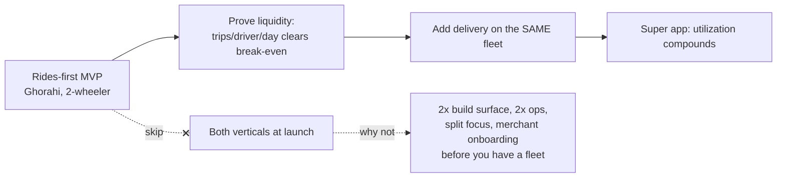
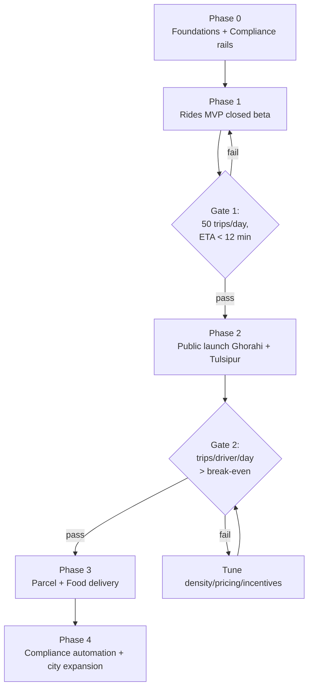

# 06 — Phased Build Plan (Solo Founder + Claude)

> Scope: A concrete, sequenced plan to go from zero to a running super app in Dang — tuned for **one systems engineer building with Claude**, not a funded team. Phases are scoped by *milestone*, not calendar dates.

---

## 0. The launch-scope decision: rides-first vs both verticals

You asked which to launch with. Here is a **clear recommendation with reasoning**, not a hedge.

### ✅ Recommendation: **Launch rides-first. Add delivery as Phase 3, not at launch.**

**Why rides-first wins for your situation:**

| Factor | Rides-first | Both at launch |
|--------|-------------|----------------|
| **Build surface** | One flow, one client pair (rider+driver) | + merchant app, catalog, order SM, COD reconciliation |
| **Cold-start** | One liquidity problem (riders↔drivers) | Two liquidity problems simultaneously |
| **Ops load (solo)** | Dispatch + support | + merchant relations + food-quality disputes |
| **Your skill fit** | Real-time dispatch = your wheelhouse | Merchant/catalog CRUD = lower-value for your time |
| **Capital** | Lower burn to first revenue | Higher burn, slower proof |
| **Regulatory clarity** | Ride-hailing rules are explicit in 2082 standard | Delivery's legal/commission treatment is fuzzier |

**The nuance — keep the *architecture* super-app-ready from day one:**
Even though you *launch* rides-only, the dispatch engine, job model, ledger, and driver app are built with a **`job.type` field (`RIDE` | `DELIVERY`)** so adding delivery later is a *feature*, not a rebuild. (See [05 §7–8](05-technical-architecture.md).)

> **One exception worth testing:** a lightweight **parcel** add-on (not food) can ride on the rides fleet very cheaply — no merchant onboarding, no catalog, just point-to-point like a ride. If early rider demand is thin, parcel is the cheapest second job-type to fill idle driver time. Food/grocery (with merchants) stays in Phase 3.

---

## 1. Phase map (milestone-gated)

> **Gates, not dates.** Don't advance because time passed; advance because the metric cleared. This protects a solo founder from scaling a broken funnel.

---

## 2. Phase 0 — Foundations & compliance rails

**Goal:** A skeleton that is *legally shaped* and deployable in-country.

**Build:**

- **Rust microservices** scaffold (monorepo, coarse-grained services) + NATS bus; PostgreSQL+PostGIS; Redis; in-country host (k3s/Kubernetes on a Nepali provider).
- Auth: phone **OTP** login, JWT/refresh, roles (rider/driver/merchant/ops).
- Core models: user, driver, vehicle, document (with expiry), **job (type=RIDE|DELIVERY)**, ledger entry.
- **Pricing engine** with parameterized legal caps (NPR 25/55 per km, 2 km min, +20% cap, 10% commission, 1% fund) — **all config-driven from the admin dashboard**, with a server-side legal clamp. (See [05 §5](05-technical-architecture.md).)
- **Immutable fare ledger** (append-only, hash-chained).
- **DoTM connector (stubbed)** behind an adapter + outbox/retry pattern.
- **Admin dashboard skeleton** (web) — fee/pricing config, KYC review, manual dispatch override, ledger view, audit log.

**Non-negotiable parallel track (legal/ops):**

- Company registration, PAN/VAT, DoTM permit application, Nepali hosting contract, insurance partner LOI, one PSP integration agreement (eSewa **or** Khalti first).

**Exit criteria:** You can create a test driver, run a simulated trip end-to-end, and see a correct ledger entry + a (stubbed) DoTM report.

---

## 3. Phase 1 — Rides MVP (closed beta, Ghorahi core)

**Goal:** Real trips with hand-picked drivers in one neighborhood.

**Build:**

- **Rider app (minimal):** OTP signup → set pickup/landmark + destination → fare estimate → book → live track → cash/one-wallet → rate.
- **Driver app:** go online (12h cap), receive sequential job offer, accept, navigate, OTP-start, complete, see net earnings, driver-balance wallet.
- **Dispatch v1:** Redis GEOSEARCH, sequential offer with timeout, widen-radius fallback, **manual override** in ops console.
- **Safety (mandatory):** SOS button → ops/control-room alert, QR-sticker verify, female-driver toggle.
- **In-app comms:** masked rider↔driver **chat + call** (WebRTC) so pickups work with landmark-based locations.
- **Settlement v1:** cash trips → driver owes 10%+1% to balance wallet; one digital method auto-split.

**Ops:**

- Recruit **20–40 motorbike drivers** in Ghorahi; field onboarding desk + "get-compliant" assist.
- Closed beta with friends/family + a few real riders; earnings guarantee for beta drivers.

**Exit / Gate 1:** ~50 trips/day, median ETA < 12 min in Ghorahi core, ledger + safety flows reliable.

---

## 4. Phase 2 — Public launch (Ghorahi → Tulsipur → link road)

**Goal:** Real liquidity and the first honest unit-economics read.

**Build/scale:**

- Harden dispatch (fairness weighting, idle-time spread); enable **auto dynamic pricing** from the admin dashboard — supply/demand surge + night-time multiplier, clamped to the legal +20%.
- Referral loops (rider→rider, driver→driver), first-ride-free, college/bazaar promos.
- Second PSP + QR acceptance (Fonepay), driver payout automation (ConnectIPS).
- Analytics in the admin dashboard (the KPIs in [04 §7](04-operational-procedures.md)).

**Sequence:** saturate **Ghorahi** → open **Tulsipur** → enable the **Ghorahi↔Tulsipur inter-city lane** (high-value rides + sets up parcel).

**Exit / Gate 2:** **trips/active-driver/day > break-even** (see [07](07-financial-model.md)) and cancellation/complaint rates under control.

---

## 5. Phase 3 — Delivery on the same fleet

> Full design: [08 — Local Delivery System](08-delivery-system.md).

**Goal:** Lift driver utilization → better retention + new revenue, without new fleet.

**Build (in order of cheapness):**

1. **Parcel** (point-to-point, no merchants): reuse ride flow + POD photo/OTP. Cheapest add-on.
2. **Food/grocery:** merchant app/web, catalog + prep-time, order state machine, COD reconciliation, unified RIDE+DELIVERY dispatch queue.

**Ops:** onboard 20–40 restaurants/shops in Ghorahi; daily/weekly merchant settlement.

**Exit:** delivery jobs measurably raise jobs/driver/day vs Phase 2 baseline.

---

## 6. Phase 4 — Compliance automation & expansion

**Goal:** Scale safely once the playbook is proven.

**Build:**

- **Full DoTM API integration** + nightly reconciliation + compliance dashboard.
- Automate insurance, SSF enrollment, accident-fund + annual-fee remittances.
- Fraud/offline-ride detection, batching, advanced analytics.
- **Multi-city config** (province-aware fare params) → replicate to Butwal/Nepalgunj/Tulsipur belt.

---

## 7. What to build vs buy vs defer

| Decision | Call | Reason |
|----------|------|--------|
| Wallet / payments | **Buy** (eSewa/Khalti/Fonepay/ConnectIPS) | Their NRB license; never build your own. |
| Maps/routing | **Self-host** (OSM + Valhalla + Nominatim/Photon) | Confirmed for cost control — no per-request Google fees. |
| Dispatch engine | **Build** (Rust) | Your edge + core IP. |
| DoTM connector | **Build** (Rust, adapter-isolated, **stubbed**) | Legally required, unique to Nepal; API not released yet — integrate when available. |
| In-app chat/calls | **Build** (WebRTC + self-hosted Coturn) | Masked rider↔driver comms; core to landmark-based pickups. |
| Mobile apps | **Build (Flutter) or contract UI** | Your skill gap — biggest risk. Android **+ iOS at launch**. |
| SMS/OTP, push | **Buy** | Commodity. |
| Surge/batching/fraud | **Defer to Phase 3–4** | Don't optimize before liquidity exists. |

---

## 8. Solo-founder execution principles

1. **Vertical slices over breadth** — one full flow working end-to-end beats ten half-built screens.
2. **Compliance rails first** — they're load-bearing; retrofitting them is painful.
3. **Simulate before you scale** — a fake-driver/fake-demand harness lets you test dispatch without a fleet.
4. **Protect mobile time** — it's your slowest lane; consider contracting the UI shell.
5. **Gate on metrics, not motivation** — advance phases only when the gate clears.
6. **Keep ops manual early** — a human (you) hand-dispatching 10 drivers teaches you what to automate.
7. **One city until it sings** — resist multi-city until Dang unit economics are proven.

➡️ Continue to [07 — Financial & Unit-Economics Model](07-financial-model.md).
