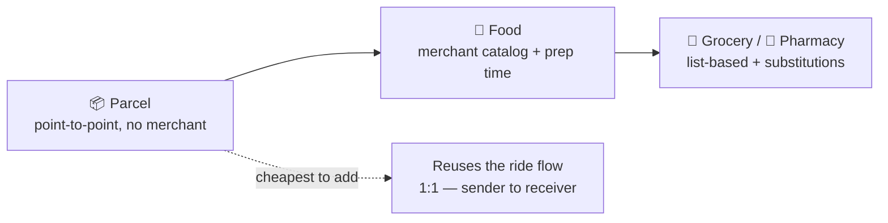
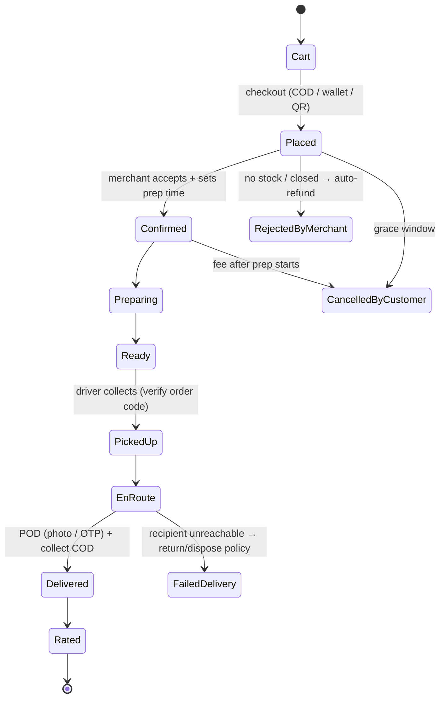
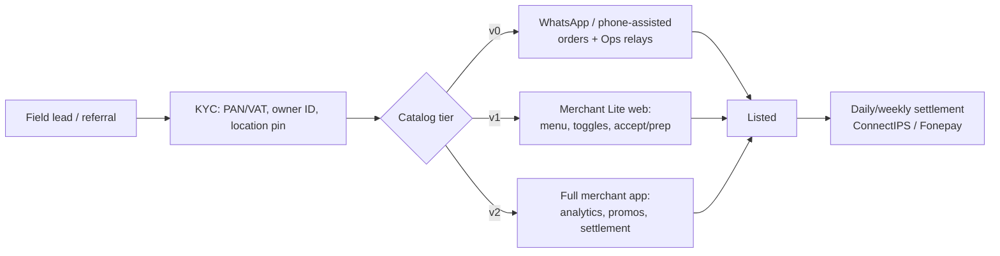
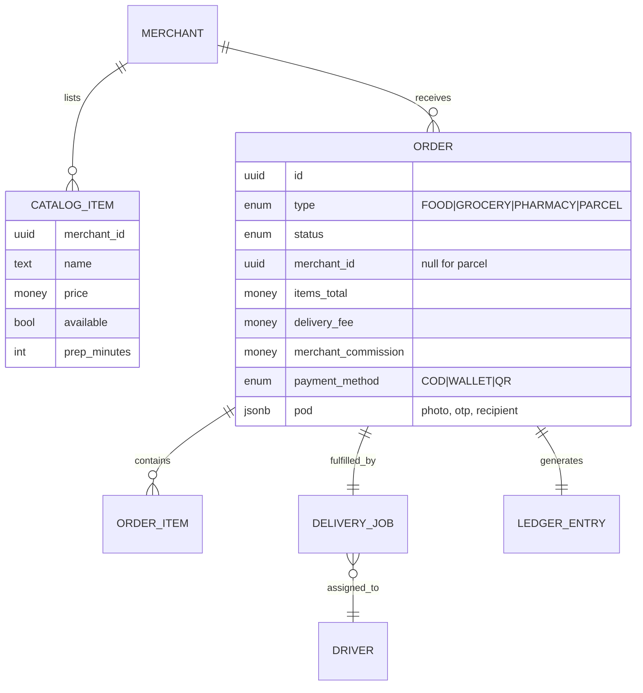
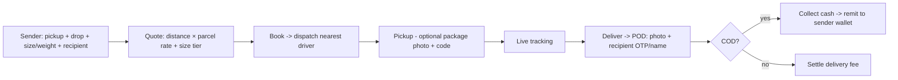

# 08 — Local Delivery System

> Scope: The full plan for Saarathi's **local delivery** vertical(s) — parcel, food, and grocery/pharmacy — running on the **same fleet** as rides. This document is the source of truth for how delivery works, how it differs from the incumbents, and how it's built. It extends the flows in [03 §4–5](03-user-flows.md), the ops in [04](04-operational-procedures.md), and the architecture in [05](05-technical-architecture.md). Sequencing lives in [06 §5](06-build-plan.md).

---

## 0. Position: delivery is a utilization lever, not a second company

The financial spine of Saarathi ([07 §1](07-financial-model.md)) is that **commission is legally capped and jobs-per-driver-per-day is the master variable.** Rides alone leave a two-wheeler idle between fares. **Delivery fills that idle time on the fleet you already have** — the same driver, app, dispatch engine, wallet, and ledger. We do *not* stand up a separate logistics business; we add a `job.type = DELIVERY` to a system that was built for it from day one ([05 §7–8](05-technical-architecture.md)).

> 🎯 **The one-line strategy:** launch **rides-first**, then add **parcel** (cheapest — no merchants), then **food/grocery** (merchant-backed). Each step lifts driver earnings without new fleet.

---

## 1. How the incumbents do delivery (and where they're beatable)

| Player | Delivery model | Commission to merchant/driver take | Weakness in Dang |
|--------|----------------|-------------------------------------|------------------|
| **Pathao** | Super app: food + parcel + courier on the bike fleet | Merchant commissions ~20–30%; rider fees | **Not present in Dang.** KTM/Terai-hub focus; national brand, not local. |
| **Foodmandu / Bhojdeals** | Food-only aggregators, own/contract riders | High merchant commission (25–30%) | Food-only (no rides to subsidize idle time); big-city only. |
| **inDrive** | Expanding into delivery/courier, P2P pricing | Low commission (~10–13%) | Thin local ops; no merchant tooling; not in Dang. |
| **Local status quo** | Restaurants self-deliver by phone; "send with a bus/known rider" for parcels | Informal, cash | Unreliable, no tracking, no proof, no recourse — **this is who we actually replace.** |

**Read:** In Dang the real competitor isn't Pathao — it's **phone-call-and-hope**. That lowers the bar (any tracked, insured, proof-backed delivery is a leap) *and* means we must be **cheap, cash-friendly, and offline-tolerant**, not feature-maximal.

---

## 2. Our delivery verticals (in build order = cheapest first)

### 2.1 Parcel (P2P) — the cheapest add-on, ship it first
- **Exactly a ride, but the passenger is a package.** Sender sets pickup + drop, size/weight tier, and recipient details. No merchant, no catalog.
- **Proof-of-delivery (POD):** photo + recipient name + OTP (or signature). Optional **fragile/valuable** flag and declared value (for the accident/insurance policy).
- **Use cases in Dang:** documents between Ghorahi↔Tulsipur, shop-to-customer, market pickups, spare parts. The **inter-city lane** ([06 §4](06-build-plan.md)) is a high-value parcel corridor.
- **Why first:** zero merchant onboarding, reuses ride dispatch/pricing, immediately fills idle driver time.

### 2.2 Food — merchant-backed, the demand-frequency engine
- Merchant catalog with items, prices, prep time, and availability toggles.
- **Prep-time-aware dispatch:** the driver is summoned to arrive *as food is ready* — not early (idle rider) nor late (cold food).
- COD-first; digital nudged.

### 2.3 Grocery / Pharmacy — list-based, later
- **List or photo order** ("send me these 6 items") rather than a full SKU catalog early — matches how kirana shops actually operate.
- **Substitution flow:** driver/shop confirms replacements or refunds the difference. Pharmacy adds a **prescription photo** step.

---

## 3. Order lifecycle (food/grocery) — the state machine

**Parcel** collapses this to `Placed → DriverAssigned → PickedUp → EnRoute → Delivered(POD) → Rated` (no merchant states).

**Failure paths we design for up front** (incumbents lose money and trust here):
- **Merchant rejects / out-of-stock** → instant auto-refund + suggest alternates. (Out-of-stock is the #1 cancellation cause — mitigate with availability toggles.)
- **Failed delivery** (recipient absent, wrong address) → retry window, then return-to-merchant or dispose policy; who bears cost is codified (customer no-show fee vs merchant error).
- **Damaged / wrong item** → photo-evidence report → refund/redeliver (ties to [11 ratings & reports](11-trust-safety-ratings-sos.md)).
- **COD short/no cash** → recorded against the order; driver protected (not out-of-pocket), customer flagged.

---

## 4. Merchant side — deliberately lightweight for a tier-3 town

Most Ghorahi/Tulsipur shops are **not** digitally sophisticated. We meet them where they are, then graduate them.

- **Tiered onboarding:** start with a **WhatsApp/phone-assisted** flow (Ops confirms orders) so a shop can go live in a day with zero hardware; graduate the willing to a **Merchant Lite web dashboard**, then a full app. This is a *supply moat* — national apps won't hand-hold a momo cart.
- **Menu with photos + prep times + availability toggles** (kill out-of-stock cancellations).
- **Merchant commission is separate from the ride commission** and is **config-driven per merchant/category** (introductory 0% to seed supply, then a fair rate — undercut Foodmandu's 25–30%).
- **Settlement:** daily/weekly to bank/wallet; a **merchant ledger** mirrors the driver wallet (owed vs paid), all appended to the immutable ledger.

---

## 5. Dispatch, pricing & money (how delivery plugs into what exists)

### 5.1 Unified dispatch
One queue, a `type` tag. A driver opts into the job types they'll take (ride / parcel / food). A free rider near a restaurant can be offered a food job — **cross-vertical dispatch is the whole point**. Prep-time gating for food; **batching** (2 nearby orders) is a Phase-4 optimization once density exists ([04 §2](04-operational-procedures.md)).

### 5.2 Delivery pricing
- **Delivery fee = base + distance × per-km delivery rate** (+ optional size/weight tier, + small-order fee). Computed by the same routing→pricing path as rides ([05 §5](05-technical-architecture.md)), so it stays config-driven and auditable.
- **Regulatory note:** the 2082 standard is explicit about *ride* fares/commission; **delivery pricing/commission is not yet clearly bounded by it.** We therefore keep delivery pricing **fully config-driven and conservative**, and treat the **10% platform-commission ethos as a self-imposed ceiling** on the *driver* side to stay consistent and driver-friendly. Merchant commission is a separate, transparent line. Flag for the lawyer at [02 §6](02-regulatory-compliance.md).
- **Promos** (free delivery, %-off) run through the [campaigns engine](09-notifications-and-referrals.md) and are **platform/merchant-funded — never out of the driver's payout.**

### 5.3 COD reconciliation (the operational crux)
COD delivery makes the driver a **cash collector**. The **driver balance wallet** ([04 §3.3](04-operational-procedures.md)) tracks: cash collected (owed to merchant/platform) vs delivery fee earned. Negative-balance threshold forces settlement before going online again. This is the same wallet rides already use — delivery just adds entries.

### 5.4 Ledger & compliance
Every completed order emits a **ledger entry** (gross, platform fee, merchant payout, driver payout, accident-fund where applicable, payment method) and, for the ride-equivalent legal surface, a DoTM report. **Trip and Order share one ledger** ([05 §7](05-technical-architecture.md)).

---

## 6. Data model additions (super-app-ready, minimal)

- **`DELIVERY_JOB` is just a `job` with `type=DELIVERY`** — it reuses the trip/dispatch/realtime plumbing from `saarathi-rides` (trips, WS, POD via `trip_events`). Parcel needs no merchant/catalog rows at all.
- POD (photo/OTP/recipient) stored like KYC docs — object storage key, kept in-country.

---

## 7. How Saarathi's delivery is different — out of the box

| Dimension | Incumbents (Pathao / Foodmandu / inDrive) | **Saarathi** |
|-----------|-------------------------------------------|--------------|
| **Fleet** | Often separate rider pools per vertical | **One fleet, rides + delivery** → higher utilization in a thin market |
| **Merchant onboarding** | App/hardware required | **WhatsApp-assisted → Lite → App** tiers; live in a day |
| **Merchant economics** | 25–30% commission | **Config-driven, introductory-0%, undercut** |
| **Payments** | Digital-leaning | **COD-first, cash reconciled in the driver wallet** |
| **Connectivity** | Assume data/GPS | **Offline-tolerant, landmark + call, SMS fallbacks** |
| **Locality** | National brand | **"Dang ko aafnai app," Nepali + Tharu/Awadhi familiarity** |
| **Trust** | Ratings only | **POD (photo/OTP) + insured, tracked, with recourse** vs phone-call-and-hope |
| **Compliance** | Retrofit | **Shared immutable ledger + DoTM hooks from day one** |

---

## 8. Build sequence (delivery slice of [06](06-build-plan.md))

**Phase 3a — Parcel (cheapest):** reuse ride flow + POD (photo/OTP). Add `type=PARCEL`, size tiers, recipient fields. Gate: parcels measurably raise jobs/driver/day.

**Phase 3b — Food:** Merchant Lite web (menu/toggles/accept-prep), order state machine, prep-time-aware dispatch, COD reconciliation, food + delivery ratings. Onboard 20–40 Ghorahi merchants (start with the momo/khaja/biryani high-frequency set).

**Phase 3c — Grocery/Pharmacy:** list/photo orders + substitution flow; prescription step for pharmacy.

**Phase 4 — Optimize:** batching (2 orders), merchant app + merchant analytics, promos, multi-city catalog config.

**Exit criteria:** delivery jobs lift **jobs/active-driver/day** above the rides-only baseline without degrading ride ETAs.

---

## 9. Package / parcel delivery — deep dive

> **Implementation status (2026-08):** *Planned, not yet built.* The backend is **already parcel-ready** — the trip model carries a `trip_type` enum (`ride | delivery`), and dispatch/realtime/ledger/POD-via-`trip_events` all work. What's missing is the parcel job flow (size tiers, recipient, POD capture, COD-remittance) and the app screens. This section is the design + the out-of-the-box wedge.

### 9.1 How others run parcel/courier in Nepal
| Player | Model | Gap we exploit |
|--------|-------|----------------|
| **Pathao Courier** | On-demand + scheduled bike courier in big cities; merchant-COD focused | Not in Dang; priced/oriented for KTM merchants, not everyday people |
| **inDrive Courier** | P2P, bargain a price, point-to-point | Thin ops, no local trust, not in Dang |
| **Aramex / DHL / local cargo** | Inter-city/national parcels, counters, next-day+ | Slow, counter-based, no live tracking, no same-hour |
| **Nepal Post** | Cheap, national, very slow | No tracking, no reliability |
| **The real incumbent: "send it on the bus"** | Hand a parcel to a bus/microbus driver; recipient collects at the park | **No tracking, no proof, no insurance, no door-to-door** — this is who we actually beat |

### 9.2 What we do out of the box (the wedge)
1. **Same-fleet, same-hour, door-to-door parcels** — a two-wheeler already idle between rides delivers a document across Ghorahi in minutes, tracked live, with photo/OTP proof. Nobody local offers this.
2. **Bus-park backhaul integration** — formalize the "send on the bus" habit: a Saarathi rider does the **first/last mile** to/from the bus park for inter-city parcels, so we ride on existing long-haul capacity instead of fighting it. A parcel Ghorahi→Kathmandu = Saarathi last-mile + partnered bus + Saarathi first-mile at the KTM end (later).
3. **Return-trip / backhaul matching** — the **Ghorahi↔Tulsipur lane** ([06 §4](06-build-plan.md)) means a driver going one way can carry a parcel the other way instead of deadheading — cheaper fares, better driver income, greener.
4. **COD collection + digital remittance** — the killer for local shops: a shop sells online, Saarathi delivers the parcel **and collects cash**, then remits it to the shop's wallet (via the driver-wallet/ledger already built). We become the tier-3 shop's fulfilment + payments rail in one.
5. **Community pickup/drop points** — the [12 §5](12-execution-roadmap.md) kirana-agent network doubles as **parcel lockers-by-trust**: drop at the corner shop, recipient collects — solves "nobody home" cheaply, no locker hardware.
6. **Proof + insurance as standard** — photo + OTP + recipient name POD, declared value, and a small parcel-protection fee → trust the informal channel can't match.

### 9.3 Parcel flow & fee

- **Fee = base + distance × parcel-per-km + size/weight tier** (config-driven, same pricing path as rides). Fragile/valuable/express are surcharge flags.
- **Size tiers:** envelope / small / medium (bike-carriable). Anything bigger → later, four-wheeler.
- **Legal note:** delivery pricing/commission isn't bound by the 2082 ride caps ([08 §5.2](08-delivery-system.md)); keep it config-driven and confirm with the lawyer.

### 9.4 Data (minimal, on top of `trips`)
Parcel reuses `trips` with `trip_type='delivery'` plus a small `parcel_details` extension (recipient name/phone-masked, size_tier, declared_value, fragile, cod_amount) and POD in `trip_events`. **No merchant/catalog tables needed** — parcel is the cheapest delivery to ship first ([08 §2.1](08-delivery-system.md)).

### 9.5 Build order
Parcel is **Phase 3a** — the first, cheapest delivery add-on (point-to-point, no merchants). It validates delivery demand before the heavier food/merchant build. Ship: parcel job type + size tiers + recipient + POD + COD-remittance, reusing dispatch/tracking/ledger.

➡️ Related: [09 — Notifications & Referrals](09-notifications-and-referrals.md) · [10 — Driver Experience & Analytics](10-driver-experience-and-analytics.md) · [11 — Trust, Safety, Ratings & SOS](11-trust-safety-ratings-sos.md) · [12 — Execution Roadmap](12-execution-roadmap.md)
