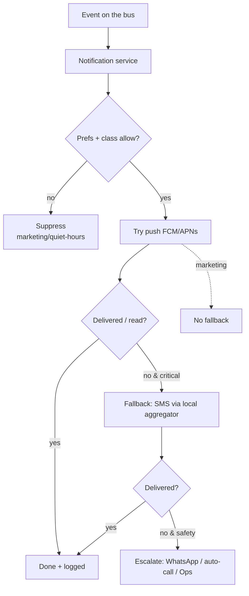
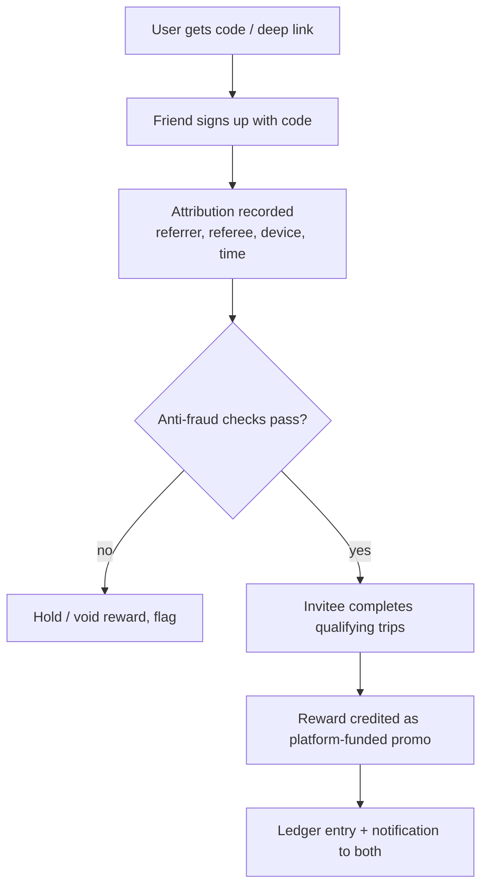

# 09 — Notifications & Referrals

> Scope: Two growth-and-engagement systems that share plumbing (both are event-driven and both must survive Dang's connectivity): the **app notification system** and the **referral system**. Notifications extend the comms design in [05 §6](05-technical-architecture.md); referrals extend the campaigns engine already built in `saarathi-rides`. Safety-critical alerts (SOS) live in [11](11-trust-safety-ratings-sos.md).

---

# Part A — Notification system

## A.1 Why this is load-bearing (not a "nice to have")
Every important moment in the app is a notification: OTP, "driver accepted," "driver arriving," "order ready," payment received, doc-expiry, promo, SOS acknowledgement. In a **low-smartphone-penetration, patchy-data** region, a notification that silently fails = a lost trip or a stranded rider. So the system is designed for **guaranteed delivery of critical messages via a fallback ladder**, not just push.

## A.2 How others do it & our difference
| | Pathao / Uber-style | **Saarathi** |
|---|---|---|
| Primary channel | Push (FCM/APNs) | Push **+ SMS fallback + WhatsApp + in-app inbox** |
| Assumption | User has data + app foregrounded | **Assume push may not arrive** → escalate to SMS for critical events |
| Language | English-leaning | **Nepali-first**, Tharu/Awadhi-aware templates |
| Marketing vs critical | Often blended | **Strictly separated**: critical always sent, marketing is opt-out + quiet-hours |

## A.3 Message taxonomy (drives routing & guarantees)

| Class | Examples | Channels | Guarantee | Opt-out? |
|-------|----------|----------|-----------|----------|
| **Safety** | SOS ack, trip-share, emergency | Push + **SMS** + in-app, loud | Highest — escalate until ack | Never |
| **Transactional** | OTP, driver assigned/arriving, order ready, payment, POD | Push → **SMS fallback** if undelivered | High — at-least-once | Never |
| **Compliance** | Doc/QR expiry, suspension, KYC decision | Push + SMS + in-app inbox | High | Never |
| **Marketing** | Promos, referrals, campaigns, re-engagement | Push / in-app / WhatsApp | Best-effort | **Yes** + quiet hours |

## A.4 The delivery ladder (the key differentiator)

## A.5 Architecture
- **`notifications` service** subscribes to domain events on the bus (NATS JetStream) — trip, order, payment, compliance, safety events. It is **not** called synchronously from hot paths.
- **Provider adapters** behind a trait (FCM/APNs, SMS aggregator, WhatsApp Business, in-app inbox), each with **outbox + retry**, mirroring the DoTM connector pattern ([05 §4](05-technical-architecture.md)).
- **Device/token registry** + **preference store** (per-user, per-class, quiet hours, language).
- **Templates**: versioned, localized, variable-interpolated; rendered server-side; every send **logged for audit** (who/what/when/channel/outcome) — also feeds delivery analytics and compliance defensibility.
- **Rate limiting & dedupe** (idempotency keys) so a retried event can't double-notify.
- **In-app inbox** is the durable record when a device is offline — reconciled on next connect (offline-tolerant, per [05 §1](05-technical-architecture.md)).

## A.6 Cost discipline
SMS costs money; push/WhatsApp/in-app don't. So: **push-first, SMS only as a fallback for critical classes**, batch marketing to in-app/WhatsApp, and cap marketing frequency. This keeps notification opex inside the thin 10% take-rate ([07](07-financial-model.md)).

---

# Part B — Referral system

## B.1 Why referrals matter here
CAC via paid ads is weak in a tier-3 town; **word-of-mouth is the channel.** A double-sided referral loop turns every happy rider/driver into a recruiter — the cheapest liquidity in a cold-start market ([04 §6](04-operational-procedures.md)).

## B.2 How others do it & our difference
- **Uber/inDrive/Pathao:** double-sided credit ("give X, get X"), code + deep link, reward after the invitee's first trip. Emerging-market versions are **plagued by referral fraud** (fake accounts, self-referral, GPS spoofing).
- **Saarathi difference:** (1) **works offline** — a field agent or driver can hand out a **verbal/printed code** at the Ghorahi desk, not just a deep link; (2) **fraud-hardened for cash markets**; (3) rewards **fund driver liquidity** (the scarce side), not just rider discounts; (4) rewards are **platform-funded promos** that never touch a driver's payout.

## B.3 Referral types

| Loop | Inviter reward | Invitee reward | Qualifying event |
|------|----------------|----------------|------------------|
| **Rider → Rider** | Ride credit | First-ride discount | Invitee completes 1st paid trip |
| **Driver → Driver** | Cash bonus | Onboarding bonus | Invitee completes N trips (e.g. 20) + passes KYC |
| **Rider → Driver** (cross) | Bounty | Onboarding bonus | Invitee activated + N trips |

Rewards, caps, windows, and amounts are **campaigns** (`audience`, `kind`, `value`, `usage_limit`) — the engine already exists in `saarathi-rides`; referrals add **attribution + anti-fraud** on top.

## B.4 Flow

## B.5 Anti-fraud (the make-or-break)
Referral fraud can bleed the budget dry. Controls:
- **Reward only after qualifying trips** (not at signup) — kills fake-account farming.
- **Device + SIM fingerprinting**, phone-number uniqueness, and **velocity limits** (per device/IP/day).
- **Self-referral block** (same device/payment instrument/contact), circular-referral detection.
- **GPS/anti-spoof + real-fare checks** so "trips" can't be faked for a payout (ties to offline-ride enforcement in [04 §5](04-operational-procedures.md)).
- **Manual review queue** in the dashboard for flagged referrals; caps per campaign; clawback on later-detected fraud.

## B.6 Data & KPIs
- **`referrals`** (referrer_id, referee_id, code, status, device_fingerprint, qualifying_progress, reward_amount, campaign_id, created_at) + **`referral_events`** for the audit trail; rewards flow through `campaign_redemptions` + the ledger.
- **KPIs:** K-factor (invites × conversion), referral share of new users, CAC-via-referral, fraud rate, driver-referral activation rate.

## B.7 Build phase
Referral loops are **Phase 2** (public launch — you need real liquidity to reward), notifications' **transactional/critical** layer is **Phase 1** (rides MVP needs "driver arriving" + OTP), with **marketing + preferences** following in Phase 2. See [06 §3–4](06-build-plan.md).

➡️ Related: [10 — Driver Experience & Analytics](10-driver-experience-and-analytics.md) · [11 — Trust, Safety, Ratings & SOS](11-trust-safety-ratings-sos.md)
