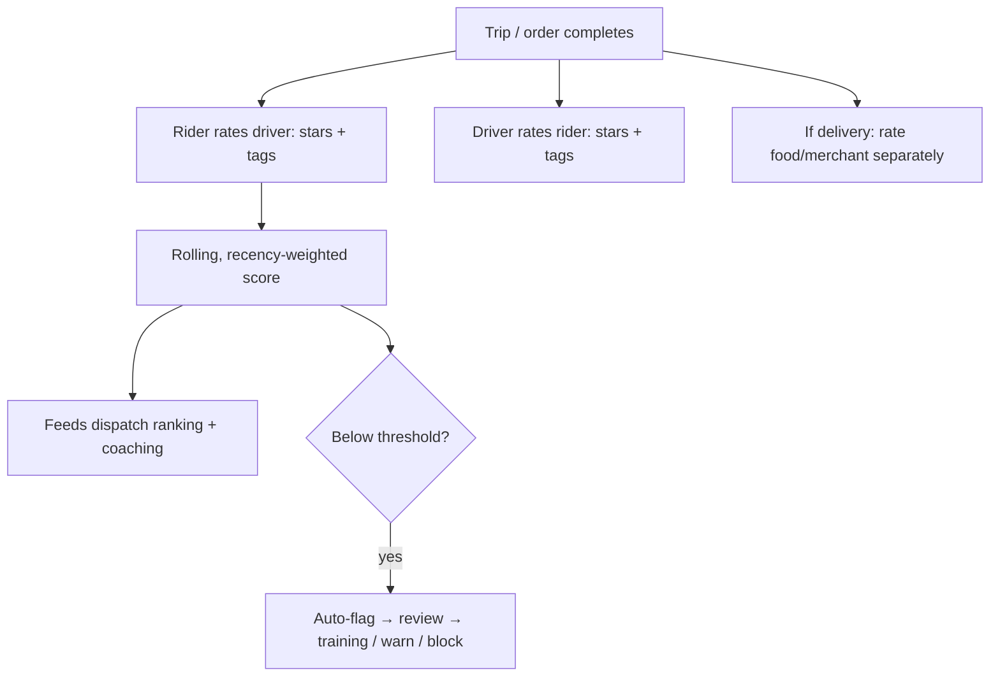
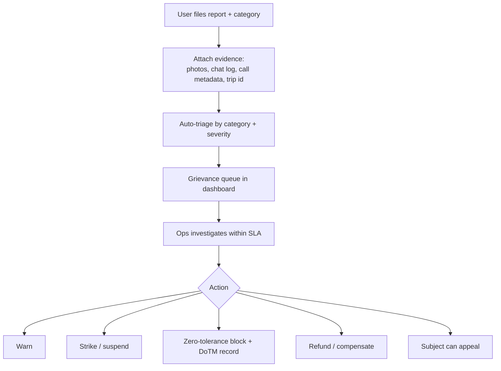

# 11 — Trust, Safety, Ratings & SOS

> Scope: The trust layer — **two-sided ratings**, the **report/complaint system**, and **emergency/SOS** for riders *and* drivers. Much of this is **legally mandated** by the 2082 standard (SOS button, 24×7 grievance & rescue cell, female-driver option, zero-tolerance offboarding). This deepens the safety flow in [03 §7](03-user-flows.md) and the trust-&-safety ops in [04 §4–5](04-operational-procedures.md).

---

## 1. Why trust is the whole game in Dang
People are handing a stranger their body (rides), their food, or their cash (COD). In a small town, **reputation travels by word of mouth** — one bad safety story can sink the brand, and one trusted rescue can make it. Unlike a big-city app, we can turn **locality into a safety advantage**: real people at a real Ghorahi desk, local-language support, and integration with **local police**, not a distant call center.

---

## 2. Ratings & reviews (two-sided)

### 2.1 How others do it & our difference
- **Uber/Pathao:** rider rates driver (and vice versa), 1–5 stars, low-rating → review. Often opaque and retaliation-prone.
- **Saarathi difference:** **transparent, tag-based, anti-retaliation, coaching-first**, and **local-language tags** so a low-literacy user can rate by tapping icons, not typing.

### 2.2 Design

- **Two-sided + separate merchant rating** for delivery (food quality ≠ delivery quality).
- **Tags over free text** ("clean vehicle," "safe driving," "late," "rude," "wrong item") — fast, language-light, and **structured** for analytics.
- **Recency-weighted rolling average** (a driver isn't defined by one bad day); low scores **coach first** (surface trends in the [driver analytics](10-driver-experience-and-analytics.md)), then warn, then block.
- **Anti-retaliation / anti-gaming:** ratings revealed only after both submit (or window closes); detect collusion and review-bombing; a single complaint doesn't auto-punish.
- Ratings **influence dispatch priority** ([04 §2](04-operational-procedures.md)) but never override compliance/fatigue rules.

---

## 3. Report / complaint system

### 3.1 Categories (structured, triaged)
| Category | Examples | SLA tier |
|----------|----------|----------|
| **Safety** | Harassment, reckless/DUI, threat | **Immediate** (merges with SOS) |
| **Vehicle/Fraud** | Off-app ride, fake GPS, wrong vehicle/QR mismatch | High |
| **Payment** | Overcharge, COD dispute, no refund | Hours |
| **Behavior** | Rudeness, no-show | Same day |
| **Delivery** | Wrong/missing/damaged item, spoiled food | Hours |
| **Lost item** | Left phone/wallet | Same day, connect both parties (masked) |

### 3.2 Flow & evidence

- **Evidence-rich:** reports carry trip id, **masked chat/call logs** ([05 §6](05-technical-architecture.md)), POD photos, GPS trail — so Ops decides on facts, not he-said-she-said.
- **Strike system + zero-tolerance:** harassment/DUI/unsafe/off-app → **immediate digital block**, documented for DoTM ([02](02-regulatory-compliance.md)); lesser issues accrue strikes.
- **Appeals** path (fairness → driver retention); every action **audit-logged** ([05 §5.4](05-technical-architecture.md)).
- Feeds the **24×7 grievance & rescue cell** ([04 §4](04-operational-procedures.md)); everything closes with a logged resolution.

---

## 4. Emergency / SOS (mandated) — for rider *and* driver

### 4.1 Requirement & our edge
The 2082 standard mandates an **in-app SOS** and a **24×7 rescue cell**. Big apps ship a "safety toolkit"; **our edge is that SOS must work when data doesn't** — the exact rural failure mode others ignore.

### 4.2 Flow
```mermaid
flowchart TD
    Trip([During any trip/delivery]) --> SOS[User/driver hits SOS]
    SOS --> Loc[Capture live location + trip + identities]
    Loc --> Ch{Data available?}
    Ch -- yes --> Ctrl[Alert control room + push live tracking]
    Ch -- no --> SMSf[Fallback: SMS with location to Ops + emergency contact]
    Ctrl --> Police[One-tap Nepal Police 100 + share details]
    SMSf --> Police
    Police --> Log[Incident logged, followed up, post-review]
    Trip --> Share[Trip-share to family (live link)]
    Trip --> CheckIn[Auto safety check-in on long stop / route deviation]
```

### 4.3 Features
- **Prominent SOS** on rider *and* driver screens during any active job.
- **Live location + trip + identities** pushed to the control room and, one-tap, to **Nepal Police (100)**.
- **Offline SOS fallback:** if there's no data, **fire an SMS** with location + trip id to Ops and the user's **emergency contact** (collected at onboarding — driver emergency contact is already in [04 §1.1](04-operational-procedures.md)). This is the single most important localization.
- **Trip-share:** share a live trip link with family (works for landmark-based trips).
- **Auto safety check-ins:** long unexpected stop or major route deviation → app prompts "are you okay?"; no response → escalate.
- **Women's safety:** female-passenger → female-driver option ([03 §2.3](03-user-flows.md)); gender-based reports fast-tracked, zero-tolerance.
- **Audio recording** during a trip where lawful (consented), available to Ops for disputes.
- **Post-incident:** every SOS logged with resolution, contributes to driver strike record and DoTM reporting.

---

## 5. Data model additions
- **`ratings`** (trip/order_id, rater_id, ratee_id, role, stars, tags[], comment, revealed_at).
- **`merchant_ratings`** (order_id, merchant_id, stars, tags[]).
- **`reports`** (id, reporter_id, subject_id, trip_id, category, severity, evidence[], status, resolution, handled_by, created_at).
- **`sos_incidents`** (id, user_id, trip_id, lat, lng, channel, status, police_notified, resolution, created_at) — append-only, audit-grade.
- Driver **strike** state derives from `reports`; block state lives on the user ([auth service](05-technical-architecture.md)).

## 6. Build phase
- **Phase 1 (mandatory to launch):** SOS (with SMS fallback), QR verify, OTP start, basic two-sided rating, grievance intake — these are **legal gates**, not nice-to-haves ([06 §3](06-build-plan.md)).
- **Phase 2:** tag taxonomy, strike system, appeals, trip-share, safety check-ins, merchant ratings.
- **Phase 4:** collusion/gaming detection, audio recording, predictive risk flags.

➡️ Related: [08 — Delivery System](08-delivery-system.md) · [09 — Notifications & Referrals](09-notifications-and-referrals.md) · [10 — Driver Experience & Analytics](10-driver-experience-and-analytics.md)
