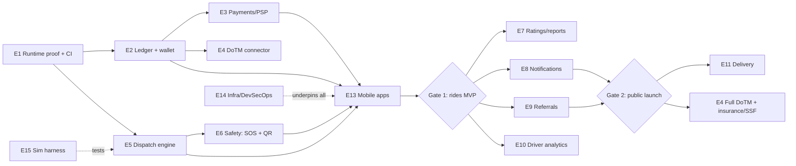

# 12 — Detailed Execution Build Plan (Engineering Roadmap)

> Scope: The **granular, engineering-level** plan for what we actually build, in what order, with concrete epics, tasks, acceptance criteria, and dependencies. This complements the **strategic, milestone-gated** [06 — Phased Build Plan](06-build-plan.md): 06 answers *"which phase and why,"* this doc answers *"which service, which task, done-when."* It reflects the code **already built** and sequences the rest. Out-of-the-box bets are in §6.

---

## 0. Where we are right now (ground truth, 2026-08)

**✅ Built & compiling (backend workspace green, 8 tests pass):**

| Area | What exists |
|------|-------------|
| `saarathi-core` | Money (`Decimal`), legal caps in one place, `quote_fare` clamp (25/55 per-km, +20% surge, 10% commission, 1% fund, 2 km min) — exhaustively unit-tested. |
| `saarathi-auth` (:8081) | Phone-OTP (argon2, rate-limited), JWT + rotating refresh tokens, driver registration, **KYC document upload** (incl. vehicle photo), **staff verification workflow** (approve/reject + audit), RBAC extractors, PostGIS saved-locations + live location pings. sqlx migrations. |
| `saarathi-rides` (:8082) | **Routing** (self-host OSRM/Valhalla + **haversine offline fallback**), **fare estimate**, trip lifecycle (create/accept/status), **realtime WebSocket** (status/location/chat + **WebRTC signaling**), **campaigns** (rider discount / driver bonus) with platform-funded discount logic. |
| `dashboard` (:3000) | Next.js staff console: OTP login, **driver verification queue + detail + doc viewer**, **campaigns management**. |
| Infra (local) | `docker-compose` (Postgres+PostGIS, Redis, NATS), `.cargo` SDKROOT fix, `.env` config. |

**❌ Not built yet (the backlog this roadmap sequences):**
Ledger + driver wallet · payments/PSP integration · DoTM connector · dispatch/matching engine · SOS/safety + QR sticker service · ratings/reports · notifications service · referrals · driver analytics · delivery/merchant/orders · **Flutter mobile apps** · production infra (k3s/Terraform/CI) · Coturn TURN · insurance/SSF/accident-fund accounting · simulation harness.

> ⚠️ **Known gap:** the services compile and are unit-tested but have **not yet run against a live Postgres** (no Docker on the current dev machine). **E1 closes this first** — nothing else is trustworthy until migrations apply and one trip flows end-to-end.

---

## 1. Execution principles (the rules we build by)

1. **Legal gates are release blockers.** SOS, QR verify, OTP-start, fare caps, commission cap, ledger, DoTM reporting — a phase does not ship without them ([02](02-regulatory-compliance.md)).
2. **Compliance rails before features.** The ledger and audit trail are load-bearing; retrofitting them is painful.
3. **Vertical slices over breadth.** One flow working end-to-end (book → dispatch → ride → ledger → payout) beats ten half-built screens.
4. **Everything config-driven + audited**, clamped server-side to the law.
5. **Offline-first is a product feature**, not a fallback afterthought.
6. **Simulate before you scale** — a fake-driver/fake-demand harness (E15) lets us test dispatch without a fleet.
7. **Protect mobile time** — it's the slowest lane; ship the driver app before the rider app.
8. **Gate on metrics, not dates.**

---

## 2. Critical path (what unblocks what)

**The single critical chain to first revenue:** `E1 → E2 → E5 → E6 → E13 → Gate 1`. Everything else is parallelizable around it.

---

## 3. Epics (detailed)

Each epic: **Goal · Service · Key tasks · Done-when (acceptance) · Depends on · Phase.**

### E1 — Runtime proof & CI/CD foundation
- **Goal:** Prove the built services run against real infra; make builds repeatable.
- **Service:** infra, auth, rides.
- **Tasks:** provision Docker/Postgres (or a Nepali dev box); run auth migrations + rides schema; seed dev super-admin; end-to-end smoke (OTP → login → register driver → upload doc → approve → estimate → create trip → WS message); GitHub Actions CI (fmt, clippy, test, build); pre-commit hooks.
- **Done-when:** a scripted smoke test passes against a live DB; CI is green on push.
- **Depends on:** nothing. **Phase 0.**

### E2 — Ledger, driver wallet & settlement (LEGAL, load-bearing)
- **Goal:** Append-only, **hash-chained** immutable ledger; driver balance wallet; settlement math.
- **Service:** new `saarathi-ledger` (or a module in rides initially).
- **Tasks:** ledger table (gross, commission 10%, fund 1%, driver_payout, method, report_status, `prev_hash`, `entry_hash`); write-on-trip-complete; driver wallet (owed vs owed-to-you); cash vs digital settlement matrix ([04 §3](04-operational-procedures.md)); negative-balance gate; accident-fund sub-ledger; exhaustive money tests.
- **Done-when:** completing a trip writes a correct, hash-linked ledger entry + updates the wallet; tamper (editing a row) breaks the chain and is detectable.
- **Depends on:** E1. **Phase 0→1.**

### E3 — Payments orchestration (PSP adapters)
- **Goal:** Real digital settlement + payouts; COD reconciliation.
- **Service:** new `saarathi-payments`.
- **Tasks:** provider trait + **one PSP first (eSewa *or* Khalti)**; payment intent + **webhook verification (signatures) + idempotency keys**; COD flow → driver wallet; payout runs (ConnectIPS/Fonepay) in Phase 2; contract tests for the webhook edge.
- **Done-when:** a digital ride auto-splits 90/10/1 into the ledger; a COD ride records the driver's cash obligation; webhooks are signature-verified and idempotent.
- **Depends on:** E2. **Phase 1 (1 PSP) → Phase 2 (payouts + 2nd PSP).**

### E4 — DoTM compliance connector (LEGAL)
- **Goal:** The legally-required government reporting, behind a stable adapter (real API not released).
- **Service:** new `saarathi-compliance`.
- **Tasks:** adapter interface + **stub**; **outbox + retry**; nightly reconciliation; report-status on the ledger; compliance dashboard feed. Swap stub → real API in Phase 4.
- **Done-when:** every completed trip enqueues a (stubbed) DoTM report with retry + visible status; reconciliation re-sends failures.
- **Depends on:** E2. **Phase 0 (stub) → Phase 4 (real).**

### E5 — Dispatch & matching engine (core IP)
- **Goal:** Turn a ride request into an assigned driver, fast, in a thin market.
- **Service:** `saarathi-rides` (or split `dispatch`).
- **Tasks:** Redis **GEOSEARCH** driver index (fed by location pings); **sequential offer** with short timeout; widen-radius fallback; eligibility filters (online, job-type opt-in, compliant docs, 12h cap, gender pref); ranking (ETA, acceptance, rating, idle-time fairness); **manual override** for Ops; cross-vertical queue (RIDE|DELIVERY) tag.
- **Done-when:** a request is offered to the best eligible driver, reassigns on timeout, and Ops can hand-assign; validated by E15's simulator.
- **Depends on:** E1 (+ E15 to test). **Phase 1.**

### E6 — Safety: SOS + QR sticker service (LEGAL, Phase-1 gate)
- **Goal:** The mandated safety layer, offline-capable.
- **Service:** new `saarathi-safety` + rides.
- **Tasks:** SOS endpoint + **offline SMS fallback** (location + trip → Ops + emergency contact) + one-tap **Nepal Police 100**; trip-share live link; QR sticker **generate + verify** endpoint (1-yr validity, scannable by rider/police); grievance intake; auto safety check-in on route deviation.
- **Done-when:** SOS reaches Ops even with no data (via SMS); rider can verify a vehicle's QR; incidents are logged append-only.
- **Depends on:** E5, E8 (SMS rail). **Phase 1.**

### E7 — Ratings & reports
- **Goal:** Two-sided trust + grievance handling ([11](11-trust-safety-ratings-sos.md)).
- **Tasks:** two-sided star + **tag** ratings (reveal-after-both), merchant rating (delivery); reports (categories, evidence, SLA triage); **strike system** + zero-tolerance block; appeals; feed dispatch ranking + driver coaching.
- **Done-when:** both parties rate; a low-rating/critical report flags for review; strikes accrue and can block; all actions audited.
- **Depends on:** E5, dashboard. **Phase 1 (basic) → Phase 2 (strikes/appeals).**

### E8 — Notifications service (delivery ladder)
- **Goal:** Guaranteed critical messaging on flaky networks ([09 A](09-notifications-and-referrals.md)).
- **Service:** new `saarathi-notify`.
- **Tasks:** subscribe to bus events; provider adapters (FCM/APNs, **SMS aggregator**, WhatsApp, in-app inbox) with outbox/retry; **push→SMS fallback for critical classes**; templates (versioned, **Nepali**); preferences + quiet hours; dedupe/idempotency; delivery logging.
- **Done-when:** "driver arriving" and OTP arrive via push, and via SMS when push fails; marketing respects opt-out/quiet-hours.
- **Depends on:** E1, bus. **Phase 1 (transactional/safety) → Phase 2 (marketing/prefs).**

### E9 — Referral system (fraud-hardened)
- **Goal:** Cheapest liquidity via word-of-mouth ([09 B](09-notifications-and-referrals.md)).
- **Tasks:** codes + deep links + **offline verbal/printed codes**; attribution; anti-fraud (reward-after-qualifying-trips, device/SIM fingerprint, velocity, self/circular-referral block, GPS anti-spoof); rewards via `campaigns`/`campaign_redemptions`; review queue + clawback.
- **Done-when:** a referred user's reward pays only after qualifying trips; fraud signals hold/void rewards; K-factor is measurable.
- **Depends on:** E2 (ledger), campaigns (built). **Phase 2.**

### E10 — Driver analytics & earnings
- **Goal:** Transparency-as-retention ([10](10-driver-experience-and-analytics.md)).
- **Tasks:** per-job net (before accept) + live day tally + 12h cap; nightly rollups (`driver_daily_stats`); demand **heatmap** (reuse pricing geohash signal); quality trends; quests (driver_bonus campaigns) with live progress; wallet + **exportable statements** (tax/loan).
- **Done-when:** driver sees accurate net earnings live and a weekly summary; heatmap shows current hotspots.
- **Depends on:** E2, E5. **Phase 1 (per-job/12h) → Phase 2 (rest).**

### E11 — Delivery vertical
- **Goal:** Fill idle time on the same fleet ([08](08-delivery-system.md)).
- **Tasks:** **Parcel first** (`type=PARCEL`, size tiers, recipient, POD photo/OTP) reusing ride flow; then **Merchant Lite web** + orders/catalog + prep-time-aware dispatch + COD reconciliation + food/merchant ratings; grocery/pharmacy list-orders later.
- **Done-when:** a parcel completes end-to-end with POD and a ledger entry; then a food order does the same with a merchant.
- **Depends on:** E2, E5, E7. **Phase 3.**

### E12 — Admin dashboard expansion
- **Goal:** Operate the business ([05 §5](05-technical-architecture.md)).
- **Tasks:** **live tracking console** (WS + Redis geo); **pricing/surge config UI** (clamped, versioned, audited); **ledger view + payout runs**; RBAC user management; DoTM report status; **SOS console** (surface + escalate); grievance queue.
- **Done-when:** Ops can watch live trips, tune fares within caps, action SOS, and review the ledger.
- **Depends on:** E2, E5, E6, E8. **Phase 1 (SOS/tracking min) → Phase 2 (pricing/ledger UI).**

### E13 — Mobile apps (Flutter) — the #1 risk
- **Goal:** Rider + driver apps (Android + iOS).
- **Tasks:** shared API/client + design system; **driver app first** (go online, 12h cap, job offer/accept, navigate, OTP-start, complete, net earnings, wallet, SOS, doc upload, QR); then rider app (OTP, set pickup/landmark + dest, estimate, book, live track, pay, rate, SOS, share trip); offline caching + reconcile; masked chat/**WebRTC call** client.
- **Done-when:** a hand-picked driver and rider complete a real trip through the apps.
- **Depends on:** E2, E3, E5, E6, E8. **Phase 1.** *Mitigation: contract the UI shell while founder owns all logic/APIs.*

### E14 — Infra & DevSecOps (production)
- **Goal:** Compliant, in-country, resilient hosting.
- **Tasks:** Terraform + **k3s on a Nepali host**; CI/CD + Helm; secrets mgmt; **self-host OSRM/Valhalla + Nominatim** with Dang OSM data; **Coturn** TURN/STUN; MinIO (in-country KYC storage, encrypted at rest); backups + tested DR; observability (logs/metrics/traces).
- **Done-when:** services deploy to the Nepali host via CI; TURN relays a call; a restore drill passes.
- **Depends on:** E1. **Phase 1 (minimal) → Phase 4 (hardened).**

### E15 — Simulation harness
- **Goal:** Test dispatch/pricing without a real fleet.
- **Tasks:** fake-driver movers (GPS tracks over Ghorahi), fake-demand generator, scenario scripts (density, surge, cancellations); metrics output (ETA, fulfilment, fairness).
- **Done-when:** dispatch can be load/behavior-tested headless; used as an E5 regression gate.
- **Depends on:** E1. **Phase 0→1.**

---

## 4. Sequenced roadmap (epics → 06 phases)

| Phase (06) | Primary epics | Exit gate |
|------------|---------------|-----------|
| **Phase 0 — Foundations** *(≈70% done)* | E1, **E2**, E4-stub, E15, E12-min | Create a test driver, run a **simulated trip end-to-end**, see a correct **ledger entry + stubbed DoTM report**. |
| **Phase 1 — Rides MVP (closed beta, Ghorahi)** | **E2, E3(1 PSP), E5, E6(SOS/QR), E7-basic, E8(txn), E10(per-job/12h), E13(driver+rider min), E14-min** | **Gate 1:** ~50 trips/day, median ETA < 12 min, ledger + safety reliable. |
| **Phase 2 — Public launch (Ghorahi→Tulsipur)** | E8(marketing/prefs), **E9 referrals**, E10(full), E12(pricing/ledger/live-track), E3(payouts+2nd PSP), E5 hardening + **surge (+20%)**, E7(strikes/appeals) | **Gate 2:** trips/active-driver/day > break-even; cancellations/complaints controlled. |
| **Phase 3 — Delivery** | **E11 (parcel → food → grocery)**, unified dispatch, merchant onboarding | Delivery lifts jobs/driver/day above rides-only baseline. |
| **Phase 4 — Compliance automation & scale** | **E4 full DoTM**, insurance/SSF/accident-fund automation, batching, fraud/offline-ride detection, multi-city config, E14 hardening | Playbook replicable to next Lumbini city. |

---

## 5. Out-of-the-box bets (execution-level differentiation)

Beyond the structural differentiators in [00-index](00-index.md), these are **buildable product bets** most platforms don't make — chosen because they fit a **low-tech, cash, hyper-local** market:

| # | Bet | Why it wins here | Phase / effort |
|---|-----|------------------|----------------|
| 1 | **USSD / IVR + SMS booking rail** | A rider with a **feature phone or no data** can book by dialing a code (agent-assisted). Incumbents are app-only; this doubles the addressable rider base in rural Dang. | Phase 2–3 · M |
| 2 | **Community agent network** (kirana shops as booking + **cash-in/out** points) | Turns trusted local shops into a **human dispatch + settlement layer**; solves cash logistics and trust in one move. | Phase 2 · M |
| 3 | **Ledger-based driver micro-credit / verified income statements** | Our immutable ledger already proves driver earnings → **statements for loans**, later fuel/EMI advances. A fintech wedge no ride app here offers. | Phase 3–4 · M |
| 4 | **Scheduled commuter pooling on the Ghorahi↔Tulsipur lane** | Fixed-route, shared two-wheeler/car seats at set times = cheaper fares, full vehicles, predictable driver income on a known corridor. | Phase 3 · M |
| 5 | **Voice-first, icon-first Nepali/Tharu UI** | Designs for **low literacy** (tap icons, voice prompts) — a real inclusion edge over text-heavy national apps. | Phase 2 · S |
| 6 | **Productized "get-compliant" assist desk** | Track a driver from private→commercial license/fitness/insurance in-app; **converts the supply incumbents can't onboard.** | Phase 1 · S |
| 7 | **Public "fair-fare & 90%-to-driver" trust page** | Show riders the fare is **capped by law** and drivers keep ≥90% — transparency as marketing ("Dang ko aafnai app"). | Phase 1 · S |
| 8 | **Offline SOS (SMS) + trip-share** | Safety that works where data doesn't — the rural failure mode others ignore (already core to E6). | Phase 1 · S |
| 9 | **Prepaid vouchers + family/business accounts** | Pre-buy rides for family/staff; fits cash culture and B2B (shops paying for deliveries). | Phase 3 · S |

> Prioritization: **#6, #7, #8** are cheap and ship inside Phase 1 (supply + trust + legal). **#1, #2** are the biggest market-expanding bets — validate demand in Phase 2 before heavy build.

---

## 6. Risk register (top risks × mitigations)

| Risk | Impact | Mitigation |
|------|--------|-----------|
| **Flutter mobile build (solo skill gap)** | Slips the whole launch | Driver app first; contract UI shell; founder owns all logic/APIs; heavy AI assist. |
| **DoTM API not released** | Can't fully comply | Adapter + stub now (E4); outbox so real API is a drop-in later. |
| **Cold-start liquidity** | No riders ↔ no drivers | Supply-first + earnings guarantees; one area (Ghorahi core); referrals; delivery to fill idle time ([04 §6](04-operational-procedures.md)). |
| **Cash fraud / off-app rides** | Revenue leakage | OTP-start, QR verify, ledger, offline-ride detection, penalties. |
| **Patchy connectivity** | Broken flows | Offline-tolerant clients, haversine fares, SMS rails, landmark+call. |
| **Solo founder bandwidth** | Everything competes | Vertical slices, ruthless phase gating, contract the risky UI. |
| **Payments integration friction** | Delays settlement | Start with one PSP; cash-first so digital isn't a launch blocker. |
| **Final law differs from draft** | Rework | Caps parameterized in one place; confirm gazetted text with lawyer ([02 §6](02-regulatory-compliance.md)). |

---

## 7. Immediate next actions (the top of the backlog)

1. **E1:** stand up Postgres, run migrations, and script the end-to-end smoke test (close Phase 0's biggest unknown).
2. **E2:** build the append-only hash-chained ledger + driver wallet, wired to trip completion.
3. **E4-stub:** emit a stubbed DoTM report on completion behind the outbox.
4. **E15:** minimal fake-driver/fake-demand simulator to exercise dispatch.
5. **E12-min + E6:** SOS console + QR verify skeleton (legal gate prep).

➡️ Strategic view: [06 — Phased Build Plan](06-build-plan.md) · Economics: [07](07-financial-model.md) · Feature designs: [08](08-delivery-system.md) · [09](09-notifications-and-referrals.md) · [10](10-driver-experience-and-analytics.md) · [11](11-trust-safety-ratings-sos.md)
