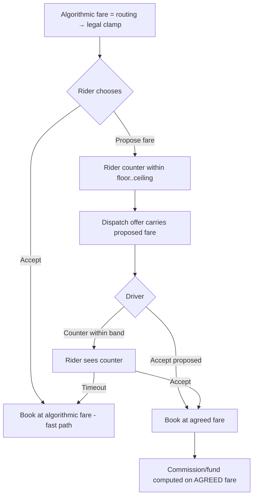

# 13 — Revenue, Credits & Bargaining

> Scope: How Saarathi makes money **inside the legal 10% commission ceiling**, plus two features requested for the model: a **prepaid credit + subscription** system (drivers/riders top up; the platform can grant "unlimited for a time"), and a **bounded fare-bargaining** feature. This extends the unit economics in [07](07-financial-model.md), the pricing clamp in [05 §5](05-technical-architecture.md), and the dispatch engine in [12 E5](12-execution-roadmap.md). It is a **planning** doc — build phases are in §8.

---

## 1. The constraint that shapes everything (recap)
The 2082 standard caps **platform commission at 10%** and fares at **NPR 25/km (2W) / 55/km (4W)**, with driver keeping **≥90%**. You **cannot** raise take-rate to fix economics ([07 §1](07-financial-model.md)). So revenue must be **diversified and legal**, and the master variable stays **jobs per driver per day**.

---

## 2. How others monetize — and what's legal here
| Player | Model | Legal in Nepal? |
|--------|-------|-----------------|
| Uber / Pathao | 15–30% commission | ❌ over the 10% cap |
| **inDrive** | Driver pays a **small per-ride fee or subscription** (not %), + **P2P fare bargaining** | ✅ **closest fit** — a lead/access-fee model sits naturally under a commission cap |
| Careem/others | Subscriptions, ads, fintech | ✅ as add-ons |

> 🎯 **Read:** the inDrive-style **prepaid access model + bargaining** is *more* compatible with Nepal's cap than percentage commission — and it's exactly what the founder proposed. We adopt it as a **portfolio** alongside the ≤10% commission, with legal guardrails.

---

## 3. The revenue portfolio
| # | Line | Who pays | Mechanism | Legal fit |
|---|------|----------|-----------|-----------|
| 1 | **Commission (core)** | rider (from fare) | ≤10% per trip (built, [E2](12-execution-roadmap.md)) | ✅ within cap |
| 2 | **Driver prepaid credits** | driver | per-job **access fee** deducted from a prepaid balance instead of chasing cash | ✅ if total take ≤10% of fares (fair-cap, §4) |
| 3 | **Driver subscription pass** | driver | flat fee for a period → **keep 100% of fares** during it | ⚠️ grey — needs the "never > 10%" fair-cap + lawyer |
| 4 | **Rider prepaid wallet (Saarathi Credits)** | rider | top-up balance to pay fares (cash-lite) + float | ✅ not extra take; improves cash flow/retention |
| 5 | **Delivery merchant commission** | merchant | separate, config-driven ([08 §5](08-delivery-system.md)) | ✅ delivery not bound by the ride cap |
| 6 | **Fintech (float + micro-credit)** | — | interest/float on prepaid balances; ledger-based driver advances ([12 §5 bet 3](12-execution-roadmap.md)) | ✅ later, with NRB view |
| 7 | **Promoted merchant listings / ads** | merchant | marketplace visibility | ✅ later |

> The **10% commission stays the backbone**; credits/subscriptions are a **driver-friendly alternative** that can *lower* the effective take for active drivers (a retention weapon), never raise it.

---

## 4. Credits & subscription (the top-up model the founder described)

### 4.1 Two credit accounts
- **Driver credit account** — the driver **pre-loads credits**; the platform's cut (commission or a flat **per-job access fee**) is **deducted from credits** when a job completes, instead of the cash-owed reconciliation in [04 §3.3](04-operational-procedures.md). A driver needs a **positive balance to go online / accept jobs**; hit zero → top up to continue. This is the "driver needs to top up credits to take rides/delivery" mechanic — and it kills debt-chasing in a cash market.
- **Rider/customer credit account** — prepaid **Saarathi Credits** to pay fares (top up via eSewa/Khalti/Fonepay). Improves cash flow, reduces cash handling, and enables **bonus credits** ("buy 500, get 550" = a platform-funded promo via the [campaigns engine](09-notifications-and-referrals.md)).

### 4.2 "Unlimited credits for a certain time" = the subscription pass
- Sell a **time-boxed driver pass** — e.g. *"Saarathi Pass — NPR 500/week, unlimited rides, keep 100% of every fare."* While active, **no per-job fee is deducted**.
- The platform can also **grant free unlimited passes** for a promo window — e.g. **"free unlimited for the first month"** at launch to **seed supply** (this is the cold-start earnings-guarantee tactic from [04 §6](04-operational-procedures.md), productized).

### 4.3 The non-negotiable compliance guardrail — "never more than 10%"
A subscription or access fee could, for a low-volume driver, exceed 10% of their fares — which would breach the driver's 90% floor. So:
> **Fair-cap:** at each period's end, if a driver paid **more than 10%** of their gross fares in fees/subscription, the surplus is **auto-credited back**. A driver can *never* be worse off than plain 10% commission.

This turns a legal risk into a **marketing promise** ("you'll never pay more than 10% — and usually less"). Implement the fair-cap as a scheduled reconciliation on the ledger. **Flag the subscription structure for the Nepali lawyer** ([02 §6](02-regulatory-compliance.md)).

---

## 5. Bargaining / fare negotiation (bounded, legal)

> This revisits the earlier "no haggling" stance in [03 §2.3](03-user-flows.md): we keep the **transparent metered fare as the anchor and the legal ceiling**, and add **optional, bounded** negotiation on top — the familiar local *mol-mol*, made safe.

### 5.1 How it works

1. The **algorithmic fare** (routing → legal clamp) is the default and the **hard maximum**.
2. The rider can **accept** (one tap) or **propose** a different fare.
   - Propose **lower** for a deal (high supply / regulars).
   - Propose **higher** to attract a driver in low supply — but **capped at the legal ceiling** (never above 25/55 per km × 1.20 surge).
3. The proposal rides along in the **dispatch offer** ([E5](12-execution-roadmap.md)); a driver **accepts** or **counters within the band**.
4. The rider accepts a counter → trip. *("Customer accepts the offered fee eventually"* — the convergence.)

### 5.2 Guardrails (make-or-break)
- **Never above the legal cap** — the [pricing clamp](05-technical-architecture.md) is re-applied to any agreed fare.
- **A driver-protecting floor** (≥ minimum fare / configurable) — no race to the bottom.
- **Commission + fund computed on the *agreed* fare** — driver still keeps ≥90% of whatever is agreed.
- **Time-boxed, few rounds** — auto-fallback to the algorithmic fare; no endless haggling.
- **Transparency** — always show the algorithmic reference so riders see the fair price (anti-gouging, builds trust).
- **Feature-flagged per city/vertical** — launch **fixed/metered** (simple, trusted); enable **bargain** later where it lifts liquidity.

### 5.3 Why it fits Dang
Bargaining is culturally normal in local markets; inDrive proved it in emerging markets. Bounding it by law gives **familiar UX + legal safety + driver protection** — a differentiator national metered apps don't offer.

---

## 6. How this hooks into the built system
- **Credits/subscription** extend the driver wallet ([E2](12-execution-roadmap.md)) and land with **payments ([E3](12-execution-roadmap.md))** — top-ups are PSP flows; fee deduction and the fair-cap are ledger operations.
- **Bargaining** extends **dispatch ([E5](12-execution-roadmap.md))**: the trip request gains an optional `offered_fare`; offers carry the proposed fare; on acceptance the trip's fare fields are recomputed from the agreed fare **before** the ledger entry — always re-clamped to the law.

---

## 7. Data model additions (planned)
- **`credit_accounts`** (owner_id, kind `rider|driver`, balance, withdrawable_balance, currency).
- **`credit_transactions`** (account_id, type `topup|fee|bonus|refund|subscription`, amount, ref, created_at) — append-only, mirrored into the ledger.
- **`subscription_passes`** (driver_id, plan, starts_at, ends_at, price, status, fair_cap_refund).
- **`fare_negotiations`** (trip_id, algo_fare, floor, ceiling, rounds `jsonb`, agreed_fare, status).

---

## 8. Phasing
| Phase | Revenue work |
|-------|--------------|
| **1** | Commission (done) + cash-first + **free launch passes (0% take)** to seed supply. |
| **2** | **Driver prepaid credits + subscription passes (with fair-cap)** + **rider prepaid wallet** + referrals; pilot **bargaining** in one zone. |
| **3** | Delivery merchant commission; bargaining for delivery. |
| **4** | Fintech (float, ledger-based micro-credit), promoted listings/ads. |

---

## 9. Legal caveats (do not skip)
1. **Subscription/access-fee vs the 10% cap** — implement the **"never more than 10%" fair-cap** as the safety net; get lawyer sign-off ([02 §6](02-regulatory-compliance.md)).
2. **Any agreed/bargained fare** must be **≤ legal ceiling** and **≥ configured floor**, commission on the agreed amount.
3. **Prepaid balances** touch NRB/PSP territory — confirm we ride PSP licenses and don't operate an unlicensed wallet ([02](02-regulatory-compliance.md)).
4. Every credit/fee/negotiation event is **config-driven, versioned, and audited**.

➡️ Related: [07 — Financial Model](07-financial-model.md) · [09 — Notifications & Referrals](09-notifications-and-referrals.md) · [12 — Execution Roadmap](12-execution-roadmap.md)
