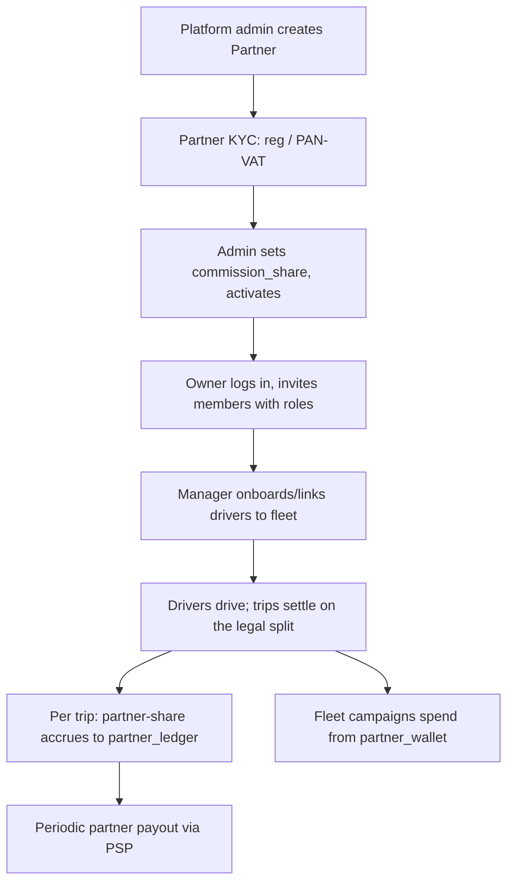

# 14 — Partnership / Fleet Program

> **Status:** Design / plan (not yet built). This is the source-of-truth design for the
> multi-tenant **fleet partner** program. See [AGENTS.md](../../AGENTS.md) golden rules —
> the legal constraints here are load-bearing.
> **Depends on:** existing `users`/`drivers`/`campaigns`/`ledger`/audit + platform RBAC
> ([05 §5](05-technical-architecture.md)), on-site KYC, credits/wallet ([13](13-revenue-and-monetization.md)).

## 1. What this is and why

A **fleet partner** is an external organisation (or individual) that brings and manages
**supply** on Saarathi — the same pattern as **Yango Fleets** and **inDrive fleet owners**.
Platform admins onboard partners; each partner has its own **staff with partner-scoped roles**,
manages its own **drivers** (and later corporate **riders**), runs **fleet-scoped campaigns**,
and settles a **share of platform revenue**.

Why this matters in Dang specifically:

- Supply in a thin market is the bottleneck. **Moto associations, bike dealers, micro-finance
  groups, and local agents** already aggregate riders and vehicles — turn them into a channel
  instead of competing with them.
- A partner who onboards, trains, finances (bike loans), and supports 30 drivers is worth far
  more than 30 cold signups. Pay them a cut of platform revenue for that work.
- Corporate accounts (hospitals, colleges, NGOs) want a **managed rider tab** — the same
  tenancy model serves them later.

## 2. Golden constraints (do not violate)

These extend the [AGENTS.md](../../AGENTS.md) golden rules; a partner program must not weaken them.

1. **The 90% driver floor is sacrosanct.** The 2082 standard mandates **≥90% of every fare to the
   driver** and **≤10% platform commission**. A partner's cut is **carved out of the platform's
   ≤10%**, *never* out of the driver's mandated 90% at source. The engine's legal clamp is
   unchanged; partner economics sit *downstream* of the split.
2. **Partner-funded promos are partner money.** A fleet campaign's discount/bonus is drawn from the
   **partner's wallet**, not the platform's — the driver payout / commission / accident-fund split
   is still computed on the **gross** fare (drivers are never short-changed by a partner's promo).
3. **Ledger stays append-only + hash-chained.** Partner revenue-share accrual and payouts are
   recorded with the same discipline; no in-place edits.
4. **Hard tenant isolation.** A partner member may only ever see/act on **their own** partner's
   drivers, trips, PII, campaigns, and money. Every partner-scoped query is filtered by
   `partner_id`, enforced server-side.
5. **Audit everything privileged.** Partner staff actions are audit-logged (`audit_log` gains a
   `partner_id` dimension), same as platform staff.
6. **Data stays in Nepal; partner KYC encrypted at rest** (business registration, PAN/VAT), reusing
   the existing document store.

## 3. Actors & roles

Two **independent** RBAC dimensions — do not overload one enum for both:

| Dimension | Where it lives | Scope |
|-----------|----------------|-------|
| **Platform role** (`user_role`) | `users.role` (existing) | The whole platform. `super_admin`/`admin` onboard & govern partners. |
| **Partner role** (`partner_role`, **new**) | `partner_members.role` | One partner (tenant). Resolved per request. |

A partner staff member is an ordinary **`user`** (phone + OTP login). Their partner authority comes
from a `partner_members` row, **not** from `users.role`. One person can even be staff for more than
one partner (rare, but the model allows it).

### Partner role matrix (partner scope only)

| Capability | owner | admin | manager | dispatcher | finance | support | viewer |
|---|:-:|:-:|:-:|:-:|:-:|:-:|:-:|
| Manage org profile / KYC | ✅ | ✅ | | | | | |
| Add/remove **members**, set roles | ✅ | ✅ | | | | | |
| Add/onboard/release **drivers** | ✅ | ✅ | ✅ | | | | |
| Assign/monitor jobs (dispatch view) | ✅ | ✅ | ✅ | ✅ | | | |
| Create/stop **fleet campaigns** | ✅ | ✅ | ✅ | | | | |
| Top up fleet wallet | ✅ | ✅ | | | ✅ | | |
| View **finance** / ledger / payouts | ✅ | ✅ | | | ✅ | | ✅(ro) |
| Handle fleet driver **support** | ✅ | ✅ | ✅ | | | ✅ | |
| View **analytics** (read-only) | ✅ | ✅ | ✅ | ✅ | ✅ | ✅ | ✅ |

`owner` is the single accountable principal (billing, can transfer ownership). `admin` is
everything-but-ownership. The rest are least-privilege operational roles.

Platform `super_admin`/`admin` retain **cross-partner** god-mode (onboard, suspend, impersonate for
support, set the commission share) — but a platform Analyst/Support does **not** get partner money
actions.

## 4. Data model

New tables (identity in **auth**, money/campaigns in **rides** — same shared DB). All partner-scoped
tables carry `partner_id` and are filtered on it in every query.

```text
-- auth service ------------------------------------------------------------
CREATE TYPE partner_type   AS ENUM ('fleet', 'corporate', 'agent');
CREATE TYPE partner_status AS ENUM ('pending', 'active', 'suspended', 'terminated');
CREATE TYPE partner_role   AS ENUM ('owner','admin','manager','dispatcher','finance','support','viewer');
CREATE TYPE partner_driver_status AS ENUM ('invited','active','suspended','left');

partners(
  id, name, legal_name, type partner_type, status partner_status,
  city, contact_phone, contact_email, pan_vat,
  commission_share numeric,        -- partner's slice of the platform's ≤10% (e.g. 0.04). Clamped: platform_keep + share ≤ 0.10
  onboarded_by uuid,               -- platform staff who created it
  created_at, updated_at)

partner_members(
  id, partner_id, user_id, role partner_role, status user_status,
  invited_by uuid, created_at, updated_at,
  UNIQUE(partner_id, user_id))

partner_drivers(
  id, partner_id, driver_user_id, status partner_driver_status,
  revenue_share numeric,           -- OPTIONAL: partner↔driver private split (Phase 2, off-platform record)
  invited_by uuid, joined_at, left_at,
  UNIQUE(driver_user_id) WHERE status = 'active')   -- a driver is in at most one active fleet

-- (Phase 3) partner_riders: corporate ride-on-company-tab members.

-- rides service -----------------------------------------------------------
-- campaigns gains a nullable partner_id + funding source:
ALTER TABLE campaigns
  ADD COLUMN partner_id uuid,                 -- null = platform campaign; set = fleet campaign
  ADD COLUMN funded_by  text DEFAULT 'platform';  -- 'platform' | 'partner'

partner_wallets(partner_id PK, balance, updated_at)          -- prepaid, funds fleet promos
partner_ledger(                                              -- append-only, per-trip share accrual + payouts
  seq bigint PK, partner_id, trip_id, kind text,             -- 'commission_share' | 'promo_spend' | 'payout' | 'topup'
  amount numeric, prev_hash, entry_hash, created_at)
partner_payouts(id, partner_id, amount, status, reference, created_at, processed_at)

-- audit_log gains partner_id (nullable) for partner-staff actions.
```

Reuse (no new machinery): `users`, `drivers`/`vehicles`/`driver_documents` (KYC),
on-site onboarding, `credit_accounts`/wallets, `ledger_entries`, `analytics_events`, `audit_log`.

## 5. Money model

**Recommended for launch — Option A: revenue-share from the platform's commission.**

Per completed trip, the platform's ≤10% commission is split into *platform-keep* + *partner-share*
(if the driver belongs to an active fleet). The **driver's ≥90% is untouched** and computed exactly
as today. Example (NPR 100 fare, 10% commission, partner share 4%):

| Party | Amount | Source |
|---|---|---|
| Driver | 89.00 | mandated ≥90% minus 1% fund (unchanged) |
| Accident fund | 1.00 | legal 1% (unchanged) |
| **Partner** | **4.00** | carved from the platform's 10% → `partner_ledger` accrual |
| Platform | 6.00 | remainder of the 10% |

`commission_share` is negotiated per partner and **clamped** so `platform_keep ≥ 0` (i.e. share ≤
the commission rate). Accrual posts to `partner_ledger` at trip completion (same tx as the main
ledger append); periodic `partner_payouts` settle it via the existing PSP hand-off.

**Fleet campaigns are partner-funded:** the discount/bonus is debited from `partner_wallets`; the
trip's gross-based split is unchanged, so the driver never eats a partner's promo. A partner tops up
its wallet like a rider tops up credits.

**Option B (later, behind legal signoff) — fleet-owner-from-driver split.** Some fleet owners
finance the bike and take a cut of the *driver's* earnings. The platform can *record* this as a
private `partner_drivers.revenue_share` and show a "what you owe your fleet" statement, but must
**not** deduct it from the mandated 90% at source, and must not represent it as platform commission.
Treat actual money movement as off-platform until a lawyer signs off.

## 6. Identity, auth & invitations

- Partner staff and drivers **log in normally** (phone + OTP). Authority is resolved from
  `partner_members` / `partner_drivers`.
- **JWT claims** gain optional `partner_id` + `partner_role`, stamped at login/refresh from the
  member's row; sensitive money/member actions **re-check server-side** (never trust stale claims).
- **Invitations:** owner/admin invites by phone → creates a `partner_members` row in `invited`
  status → invitee gets an SMS deep-link / sees a pending invite on next login → accepts. Same
  pattern for adding an existing driver to a fleet (`partner_drivers` `invited` → driver consents →
  `active`). New drivers use the existing **on-site KYC** onboarding, tagged with `partner_id`.
- A platform admin can **impersonate** a partner for support only, always audit-logged.

## 7. API surface

**Platform admin (existing staff RBAC):**
```
POST   /v1/admin/partners                 create (super_admin/admin)
GET    /v1/admin/partners[?status=]       list
GET    /v1/admin/partners/{id}            detail (+ members, driver count, balances)
PUT    /v1/admin/partners/{id}            set status / commission_share
POST   /v1/admin/partners/{id}/suspend|activate
```

**Partner-scoped (partner members; every route resolves + checks `partner_id` and `partner_role`):**
```
GET    /v1/partner                        my partner(s) + my role
GET/POST/PUT/DELETE /v1/partner/members   invite / set-role / remove   (owner|admin)
POST   /v1/partner/drivers                add existing (by phone) OR onboard new  (owner|admin|manager)
GET    /v1/partner/drivers[?status=]      fleet roster
PUT    /v1/partner/drivers/{id}           suspend / release
POST   /v1/partner/campaigns              create fleet campaign (partner-funded)  (owner|admin|manager)
GET    /v1/partner/campaigns              list / deactivate
GET    /v1/partner/analytics              fleet KPIs + driver leaderboard (scoped)
GET    /v1/partner/wallet                 balance; POST /v1/partner/wallet/topup
GET    /v1/partner/ledger                 share accrual + spend; GET /v1/partner/payouts
```

Ownership: **auth** owns `partners`/`members`/`drivers` (identity); **rides** owns fleet campaigns,
wallet, ledger, analytics. Reuse the standardized `{ error: { code, message } }` envelope + new
codes (`PARTNER_FORBIDDEN`, `NOT_A_MEMBER`, `DRIVER_ALREADY_IN_FLEET`, `PARTNER_SUSPENDED`).

## 8. Lifecycle



## 9. Multi-tenancy & security enforcement

- **Every** partner-scoped handler: extract member row for `(claims.sub, partner_id)`, 403 if none,
  then check `partner_role` allows the action. No implicit cross-tenant reads.
- Fleet analytics/leaderboards scope trips to `driver_user_id ∈ partner_drivers(active)`.
- `partner_id` on `audit_log`; all member/driver/money mutations audited.
- Rate-limit invites; verify a driver **consents** before fleet linkage (prevents hijacking supply).
- Consider Postgres **RLS** as defence-in-depth once the surface stabilises.

## 10. Dashboard

- **Platform → Partners** (new section, platform RBAC): list, onboard, KYC review, set
  `commission_share`, suspend/activate, drill into a partner (members, drivers, balances).
- **Partner portal** (same Next.js app, a `/partner` route-group gated by partner claims): Overview,
  Members, Fleet Drivers (roster + onboard + release), Campaigns, Analytics, Finance (wallet, ledger,
  payouts). Nav renders from the member's `partner_role` (least-privilege).

## 11. Concrete integration points (existing code)

| Area | Touch |
|---|---|
| auth `schema.sql` | new enums + `partners`/`partner_members`/`partner_drivers`; `audit_log.partner_id` |
| auth routes | `partner_routes.rs` (platform admin) + `partner_portal_routes.rs` (member-scoped); `PartnerMember` extractor |
| auth JWT (`token.rs`, `auth.rs`) | optional `partner_id`/`partner_role` claims |
| on-site KYC (`admin_routes.rs`) | accept `partner_id` → write `partner_drivers` |
| rides `schema.sql` | `campaigns.partner_id`/`funded_by`; `partner_wallets`/`partner_ledger`/`partner_payouts` |
| rides `campaigns.rs` | fleet campaign create/list scoped to partner; funded-by-partner path |
| rides `ledger.rs` | on completion, if driver in active fleet → accrue `commission_share` to `partner_ledger` |
| rides `metrics.rs` | partner-scoped overview/leaderboard |
| dashboard | Partners (platform) + `/partner` portal + `lib/api.ts` types/methods |

## 12. Phased build plan

- **Phase 1 — Tenancy & fleet management (identity only, no money).**
  `partners` + `partner_members` (RBAC) + platform onboarding + partner adds/links/releases drivers
  (reusing on-site KYC) + fleet roster + read-only fleet analytics. JWT partner claims.
  *Exit:* an admin creates a partner; the owner invites a manager; the manager onboards a driver;
  that driver completes a trip; it shows in the fleet roster + fleet analytics — isolated from other
  partners.
- **Phase 2 — Fleet money.** Partner wallet + top-up; partner-funded fleet campaigns; per-trip
  `commission_share` accrual to `partner_ledger`; partner payouts. *Exit:* a fleet promo spends from
  the wallet and a completed trip accrues the partner's share; a payout settles it; chain intact.
- **Phase 3 — Corporate & scale.** Corporate rider accounts (ride-on-company-tab), partner dispatch
  console, partner API keys/webhooks, self-serve partner signup + KYC queue, tiered/negotiated
  commission, quality SLAs and auto-suspension.

## 13. Risks & open questions

- **Legal:** confirm with counsel that revenue-share-from-commission (Option A) is clean under the
  2082 standard, and that any Option-B fleet-from-driver arrangement is contractual/off-platform.
- **Supply hijacking:** driver consent + one-active-fleet invariant guard against a partner claiming
  drivers they don't manage.
- **Payout float & tax:** partner payouts have TDS/VAT implications — Finance sign-off needed.
- **Scope creep:** keep Phase 1 identity-only; do not couple money in until tenancy isolation is
  proven in the smoke test.

## 14. Out-of-the-box bets (Dang-fit)

- **Micro-finance / co-op fleets:** partner = a savings group that finances bikes; Saarathi is the
  utilisation + repayment-visibility layer (ties into ledger-based driver micro-credit, [12 §5]).
- **Bike-dealer fleets:** dealers sell a bike *with* a Saarathi earning plan attached.
- **Institutional corporate tabs:** a hospital/college pre-pays a rider wallet for staff/patients —
  same tenancy, `partner_type = 'corporate'`.
